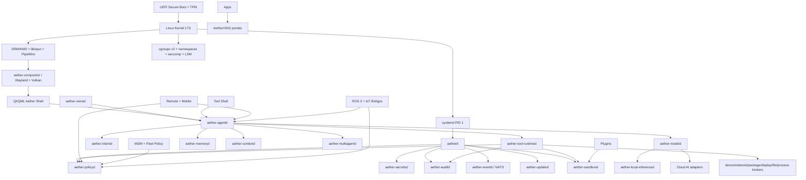
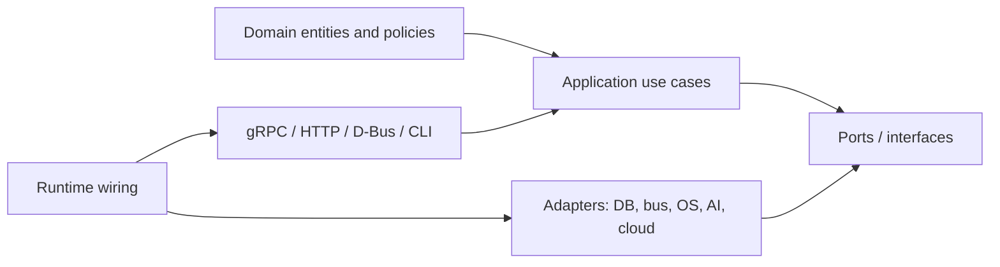

# Aether OS Software Architecture

Status: foundational architecture, no implementation code
Date: 2026-08-06
Project name: Aether OS, temporary

## 0. Executive Architecture

Aether OS is a Linux-based, AI-first operating system where the AI agent is the primary user interface and a first-class system control plane. It is not a conventional desktop environment with a chatbot. The AI agent is part of the trusted OS architecture, but it is constrained by capability policy, auditability, sandboxing, human consent rules, and deterministic service APIs.

Core thesis:

- The Linux kernel, systemd, Wayland, Vulkan, PipeWire, cgroups v2, namespaces, seccomp, LSM policy, TPM-backed identity, and immutable OS updates provide the operating substrate.
- Aether Core provides a typed, observable, least-privilege control plane for the AI, UI, apps, plugins, enterprise fleet, mobile companion, remote control, and future robotics bridge.
- The AI agent never receives raw root-equivalent authority. It requests capabilities through policy and executes operations through typed tools exposed by privileged brokers.
- Every service follows Clean Architecture: domain model first, application use cases second, ports third, adapters last. Infrastructure is replaceable.

Primary layers:

1. Firmware and hardware trust: UEFI Secure Boot, TPM 2.0, measured boot, device identity, disk encryption.
2. Kernel substrate: Linux LTS, cgroups v2, namespaces, seccomp, eBPF observability, LSM policy.
3. OS foundation: systemd PID 1, udev, logind, PipeWire, NetworkManager or systemd-networkd, immutable rootfs.
4. Aether Core: service registry, policy, secrets, audit, event bus, sandbox manager, update manager, system control brokers.
5. AI control plane: voice, text, intent, planner, multi-agent orchestration, model router, memory, tool runtime.
6. Experience layer: Wayland compositor, Vulkan renderer, Qt/QML shell, assistant surfaces, settings, notification center.
7. Extensibility layer: WASI plugins, native signed plugins, OCI apps, microVM isolation for high-risk workloads, portals.
8. Enterprise and edge: fleet enrollment, identity, policy sync, remote support, telemetry export, air-gapped updates.
9. Companion and robotics: mobile companion, WebRTC remote control, ROS 2 bridge, IoT protocol bridges.

## 1. Complete Folder Structure

Target monorepo:

```text
aether-os/
  README.md
  SECURITY.md
  CONTRIBUTING.md
  CODEOWNERS
  LICENSES/
  governance/
    adr/
    rfcs/
    decision-records/
    threat-models/
    compliance/
  docs/
    architecture/
    boot/
    security/
    api/
    ui-ux/
    enterprise/
    robotics/
    operations/
    developer-handbook/
  distro/
    image-recipes/
    packages/
    ostree/
    installer/
    recovery/
    bootloader/
    initramfs/
    systemd-units/
    kernel-config/
    hardware-profiles/
  kernel/
    configs/
    patches/
    modules/
    e2e-kernel-tests/
    vendor-bsp/
  interfaces/
    proto/
    openapi/
    dbus/
    wayland-protocols/
    wit/
    cloudevents/
    jsonschema/
    capabilities/
    error-catalog/
  crates/
    aether-domain/
    aether-ipc/
    aether-policy-sdk/
    aether-observability-sdk/
    aether-secrets-sdk/
    aether-sandbox-sdk/
    aether-system-sdk/
    aether-testing/
  services/
    aetherd/
    aether-policyd/
    aether-secretsd/
    aether-auditd/
    aether-eventd/
    aether-observabilityd/
    aether-updated/
    aether-packaged/
    aether-sandboxd/
    aether-deviced/
    aether-networkd/
    aether-displayd/
    aether-agentd/
    aether-intentd/
    aether-modeld/
    aether-local-inferenced/
    aether-memoryd/
    aether-voiced/
    aether-contextd/
    aether-tool-runtimed/
    aether-multiagentd/
    aether-shell-sessiond/
    aether-notificationd/
    aether-indexerd/
    aether-searchd/
    aether-remoted/
    aether-identityd/
    aether-mdmd/
    aether-syncd/
    aether-ros-bridge/
    aether-iot-bridge/
  ai/
    agent-definitions/
    orchestration-graphs/
    model-registry/
    provider-adapters/
    memory-schemas/
    safety-policies/
    evals/
    prompts/
    red-team-suites/
  ui/
    compositor/
    shell/
    settings/
    assistant-panel/
    lock-screen/
    login/
    design-system/
    qml-components/
    themes/
    assets/
  apps/
    terminal/
    files/
    settings/
    system-monitor/
    app-store/
    enterprise-enrollment/
  plugins/
    sdk/
    examples/
    marketplace-metadata/
    permission-manifests/
    wasi-hosts/
    native-hosts/
  mobile/
    shared-rust-core/
    android/
    ios/
    companion-api/
    pairing/
  enterprise/
    fleet-server/
    policy-server/
    update-server/
    telemetry-gateway/
    identity-connectors/
    mdm-connectors/
  robotics/
    ros2-bridge/
    simulation/
    robot-profiles/
    safety-zones/
    realtime/
  security/
    selinux/
    apparmor/
    seccomp/
    sandbox-profiles/
    signing/
    sbom/
    vuln-management/
    secrets/
    audit/
  observability/
    otel-collector/
    dashboards/
    alerts/
    log-schemas/
    trace-schemas/
  tests/
    unit/
    integration/
    contract/
    e2e/
    qemu-boot/
    hardware-lab/
    fuzz/
    chaos/
    performance/
    accessibility/
    security/
    ai-evals/
  tools/
    xtask/
    codegen/
    image-builder/
    api-lint/
    policy-lint/
    release/
    devshell/
  build/
    cargo/
    cmake/
    python/
    qml/
    containers/
  deploy/
    oem/
    enterprise/
    cloud/
    airgap/
    recovery-media/
  ci/
    pipelines/
    reusable-workflows/
    runners/
    signing/
    provenance/
```

Per-service template:

```text
services/<service-name>/
  README.md
  api/
    <service>.proto
    <service>.openapi.yaml
    <service>.dbus.xml
    events.yaml
    capabilities.yaml
  src/
    domain/
    application/
    ports/
    adapters/
    interface/
    infrastructure/
    bin/
  config/
  migrations/
  policies/
  systemd/
  tests/
    unit/
    integration/
    contract/
  docs/
    operations.md
    threat-model.md
    api.md
```

Clean Architecture rule for every service:

- `domain` has no dependency on OS, network, database, AI SDK, or framework.
- `application` depends only on `domain` and `ports`.
- `ports` define traits/interfaces for storage, bus, clocks, policy, models, and external systems.
- `adapters` implement ports for SQLite, Qdrant, NATS, gRPC, D-Bus, Wayland, PipeWire, cloud APIs, and local model runtimes.
- `interface` exposes gRPC, HTTP, D-Bus, CLI, or systemd activation entrypoints.
- `infrastructure` contains runtime wiring, config loading, migrations, and telemetry setup.

## 2. Repository Architecture

Initial strategy: one core monorepo for the OS, because cross-service API compatibility, image composition, security policy, and boot testing must evolve atomically.

Repository split after product maturity:

- `aether-os`: distro, services, interfaces, UI, built-in apps, tests.
- `aether-kernel`: kernel configs, vendor BSP integrations, hardware enablement, long-term kernel patch queue.
- `aether-enterprise`: fleet server, update server, policy server, admin console.
- `aether-mobile`: companion apps, shared Rust core, pairing flows.
- `aether-plugins`: official plugin SDK, marketplace contracts, examples.
- `aether-robotics`: ROS 2 bridge, simulation tooling, robot profiles.

Release topology:

- `main`: always releasable after full CI.
- `release/YYYY.N`: stabilization branch.
- `lts/YYYY.N`: enterprise long-term branch.
- `security/YYYY-NNN`: embargo-capable security branches.
- `vendor/<oem>/<device>`: hardware enablement branches.

Versioning:

- OS images: calendar version plus build identity, for example `2026.10.0+build.1842`.
- Public APIs: semantic versioning by package, for example `aether.agent.v1`.
- Events: append-only schema evolution with explicit event type version.
- Plugins: manifest API version plus runtime compatibility range.

## 3. Services

Foundation services:

| Service | Language | Responsibility | Critical path |
| --- | --- | --- | --- |
| `aetherd` | Rust | Core registry, service health, device state, lifecycle coordination above systemd | boot |
| `aether-policyd` | Rust | Capability authorization, consent rules, risk scoring, enterprise policy merge | boot |
| `aether-secretsd` | Rust | TPM-backed keys, secret handles, encryption keys, provider credentials | boot |
| `aether-auditd` | Rust | Append-only audit stream, security event storage, evidence export | boot |
| `aether-eventd` | Rust | Local NATS subject governance, durable event streams, replay windows | boot |
| `aether-observabilityd` | Rust | OpenTelemetry setup, journald bridge, eBPF collectors, health metrics | boot |
| `aether-updated` | Rust | Atomic OS updates, rollback, plugin updates, model artifact updates | boot |
| `aether-packaged` | Rust | App/plugin install, signature checks, dependency policy, content index | runtime |
| `aether-sandboxd` | Rust | WASI, OCI, bubblewrap, seccomp, cgroups, microVM launch broker | runtime |
| `aether-deviced` | Rust | Hardware inventory, udev bridge, power, batteries, sensors, hotplug | runtime |
| `aether-networkd` | Rust | Network profiles, VPN, firewall state, connectivity events | runtime |

Display and user-session services:

| Service | Language | Responsibility | Critical path |
| --- | --- | --- | --- |
| `aether-displayd` | Rust/C FFI | DRM/KMS, libinput, display topology, GPU capability broker | session |
| `aether-compositor` | Rust/C++ as needed | Wayland compositor, Vulkan renderer, shell protocol, secure surfaces | session |
| `aether-shell-sessiond` | Rust | Session lifecycle, lock state, user seat, shell privileges | session |
| `aether-shell` | Qt/QML + Rust/C++ bridge | Premium UI shell, assistant surface, settings, notifications | session |
| `aether-notificationd` | Rust | System notifications, agent notifications, do-not-disturb policy | runtime |

AI and agent services:

| Service | Language | Responsibility | Critical path |
| --- | --- | --- | --- |
| `aether-agentd` | Python orchestration + Rust host | Primary agent runtime, task loop, planning, tool calls, user interaction | session |
| `aether-multiagentd` | Python | Agent graph execution, specialist agents, supervisor/critic/verifier roles | runtime |
| `aether-intentd` | Rust/Python | Voice/text intent parsing, command routing, ambiguity detection | session |
| `aether-modeld` | Rust | Provider-neutral model registry, routing, quotas, privacy policy | session |
| `aether-local-inferenced` | Rust/C++/Python | Local LLM, embedding, ASR, TTS, vision inference servers | runtime |
| `aether-memoryd` | Rust | Long-term memory, SQLite metadata, vector database, retention policy | session |
| `aether-voiced` | Rust/C++/Python | Wake word, ASR, TTS, barge-in, audio session coordination | session |
| `aether-contextd` | Rust | Context broker, screen/app/file/device context, privacy redaction | session |
| `aether-tool-runtimed` | Rust | Typed OS tools, transactional system control, shell mediation | session |
| `aether-indexerd` | Rust | File/app/event indexing, embeddings pipeline, document extraction | runtime |
| `aether-searchd` | Rust | Hybrid search over files, memory, apps, docs, enterprise connectors | runtime |

Enterprise, remote, mobile, and robotics services:

| Service | Language | Responsibility | Critical path |
| --- | --- | --- | --- |
| `aether-identityd` | Rust | Local accounts, OIDC, SCIM, device identity, enterprise enrollment | boot/runtime |
| `aether-mdmd` | Rust | MDM policy, compliance state, remote lock/wipe, fleet commands | runtime |
| `aether-remoted` | Rust | WebRTC remote support, screen share, remote terminal, consent gates | runtime |
| `aether-syncd` | Rust | Memory/settings sync, encrypted backup, cross-device state | runtime |
| `aether-ros-bridge` | Rust/C++ | ROS 2 bridge, topics/services/actions mapping, robotics safety broker | optional |
| `aether-iot-bridge` | Rust | MQTT/Matter bridge, local device automation, edge sensors | optional |

Service replaceability contracts:

- A service can be replaced only if it passes its contract tests, emits required telemetry, honors capability checks, and supports migration for owned data.
- Shared libraries are allowed only for stable primitives. Business logic is owned by services, not shared utility packages.
- Direct database access across services is forbidden.
- Direct privileged OS calls from AI, UI, plugins, or apps are forbidden.

## 4. Modules

Core modules:

- Identity module: user identity, device identity, enterprise tenant, local sessions, account recovery.
- Capability module: operation authorization, consent prompts, risk labels, delegated scopes, policy inheritance.
- Audit module: security events, model/tool decisions, system mutations, enterprise evidence export.
- Secrets module: TPM sealing, credential handles, provider tokens, rotation, emergency recovery.
- Event module: CloudEvents-compatible event envelopes, durable event streams, replay, dead-letter queues.
- Update module: OS image updates, app/plugin/model updates, rollback, staged rollout, ring promotion.
- Sandbox module: seccomp profiles, cgroups, namespaces, WASI host functions, OCI runtime, microVM policies.
- Observability module: logs, metrics, traces, profiling, eBPF probes, crash reports.

AI modules:

- Conversation module: user turns, system prompts, tool traces, ephemeral context.
- Intent module: command classification, missing-slot detection, ambiguity handling.
- Planner module: task decomposition, plan validation, rollback strategy.
- Tool module: typed OS tools, dry runs, preflight checks, postcondition verification.
- Memory module: episodic memory, semantic memory, procedural memory, user preferences, enterprise knowledge.
- Model module: model registry, provider routing, local/cloud failover, privacy constraints, cost budgets.
- Multi-agent module: supervisor, executor, researcher, verifier, security reviewer, UI helper, device specialist.
- Safety module: policy blocks, sensitive operation confirmation, jailbreak resistance, data loss prevention.

Experience modules:

- Voice shell: wake word, streaming ASR, TTS, audio focus, interruption handling.
- Text shell: command palette, chat surface, terminal bridge, natural-language search.
- Visual shell: Wayland compositor, secure overlays, notification center, workspace management.
- App model: native apps, sandboxed apps, web apps, plugin surfaces, shell extensions.
- Accessibility: screen reader integration, dictation, voice navigation, keyboard-only control.

Enterprise modules:

- Fleet enrollment, device compliance, policy assignment, update rings, remote support, audit export, SIEM export.
- Identity federation through OIDC and SCIM.
- Admin APIs through OpenAPI plus gRPC for internal high-volume control.

Robotics modules:

- ROS 2 graph bridge, robot capability broker, geofence/safety zones, simulation-first testing, real-time event bridge.
- The AI can propose robot actions, but safety-certified robot controllers own actuation.

## 5. Dependency Graph

Layer graph:



Clean Architecture dependency direction:



Dependency rules:

- Domain never imports adapters.
- Application never imports concrete storage, network, UI, AI provider, or OS APIs.
- Adapters may depend on external systems, but must be replaceable behind ports.
- Public APIs are contract-first and generated from `interfaces/`.
- AI services depend on policy and tool contracts, not privileged implementation details.

## 6. Technology Choices

| Area | Default choice | Reason | Replacement boundary |
| --- | --- | --- | --- |
| Kernel | Linux LTS plus curated configs | Hardware ecosystem, security modules, cgroups, namespaces | kernel config and BSP layer |
| Init/service manager | systemd | PID 1, dependency units, sandboxing, journald integration | `distro/systemd-units` |
| OS updates | OSTree/rpm-ostree style immutable deployments | Atomic updates, rollback, reproducible images | `aether-updated` port |
| Root integrity | dm-verity, signed initramfs, measured boot | Tamper evidence and immutable base | boot policy |
| Core services | Rust | memory safety, concurrency, performance | service API contracts |
| AI orchestration | Python inside constrained hosts | AI ecosystem velocity and graph orchestration | orchestration port |
| Low-level graphics/input | Rust with C FFI where necessary | safety first, practical access to libdrm/libinput/Vulkan | display adapter |
| UI | Qt 6 / QML | premium native UI, animation, device UI support | shell protocol |
| Display protocol | Wayland | compositor-owned display model, modern Linux graphics | custom protocol versioning |
| Rendering | Vulkan | explicit GPU control and future compute use | renderer backend |
| Audio/video | PipeWire | modern Linux multimedia graph and sandbox-friendly device access | media adapter |
| IPC RPC | gRPC + Protobuf over Unix sockets locally, mTLS over TCP remotely | typed contracts, streaming, code generation | `interfaces/proto` |
| Desktop IPC | D-Bus | Linux desktop/session integration | D-Bus XML contracts |
| Event bus | NATS with CloudEvents envelopes | low-latency pub/sub, request/reply, durable streams | event adapter |
| Remote/mobile HTTP | OpenAPI REST gateway | broad client support and enterprise integration | `interfaces/openapi` |
| Local relational DB | SQLite WAL, optional SQLCipher | embedded reliability, transactional metadata | repository port |
| Vector DB | Qdrant local/edge profile by default | Rust vector database, local semantic search | vector repository port |
| Full-text search | SQLite FTS5 plus index service | local search over structured metadata | search adapter |
| Local LLM | llama.cpp for GGUF, vLLM for GPU server class devices | local inference across device classes | model provider port |
| ML inference | ONNX Runtime | speech, vision, classic ML, accelerator support | model runtime port |
| Cloud AI | Provider-neutral adapters, OpenAI-compatible API where possible | avoid cloud lock-in | model provider port |
| Plugins | WASI first, native signed plugins second | capability-based portable sandboxing | plugin host ABI |
| App sandbox | Flatpak-style portals, bubblewrap, OCI, microVM for high risk | layered isolation | sandbox profile |
| High-risk execution | Kata Containers or Firecracker-class microVMs | VM-grade isolation for untrusted workloads | sandbox backend |
| Observability | OpenTelemetry, journald, eBPF | traces, metrics, logs, kernel insight | telemetry adapter |
| Supply chain | SLSA, Sigstore, SPDX SBOM, TUF | provenance, signing, update security | release pipeline |
| Identity | OIDC, SCIM, local FIDO2/WebAuthn-ready design | enterprise federation and provisioning | identity adapter |
| Robotics | ROS 2 bridge over DDS concepts | industry robotics ecosystem | bridge adapter |
| IoT | MQTT and Matter bridge | local device control and interoperability | bridge adapter |
| Remote control | WebRTC | screen/audio/data channels for support and companion | remote transport |

## 7. Communication Between Modules

Communication standards:

- Synchronous internal RPC: gRPC over Unix domain sockets for local privileged services.
- Cross-device or enterprise RPC: gRPC over mTLS with device certificates.
- Remote/mobile public APIs: REST/JSON documented with OpenAPI; WebSocket or Server-Sent Events only for UI streaming where gRPC is unsuitable.
- Asynchronous events: NATS subjects carrying CloudEvents-compatible envelopes.
- Desktop/session interop: D-Bus for Linux desktop services, portals, and user-session activation.
- Display: Wayland protocols with Aether shell extensions in `interfaces/wayland-protocols/`.
- Audio/video: PipeWire streams and session policy mediated by `aether-voiced` and `aether-remoted`.
- High-throughput local data: Unix sockets, shared memory, memfd, dma-buf for graphics/media.
- Robotics: ROS 2 topics, services, and actions through a constrained bridge.
- IoT: MQTT v5 and Matter through a constrained bridge.

Event subject naming:

```text
aether.<scope>.<domain>.<entity>.<event>.v<version>
aether.device.power.battery.changed.v1
aether.agent.task.completed.v1
aether.security.policy.denied.v1
aether.memory.embedding.indexed.v1
```

Required event envelope fields:

- `id`: globally unique event id.
- `source`: service instance URI.
- `type`: CloudEvents-style event type.
- `subject`: resource identifier.
- `time`: RFC 3339 timestamp.
- `trace_id`: distributed trace id.
- `actor`: user, agent, service, or device principal.
- `capability`: capability used, if any.
- `tenant_id`: enterprise tenant where applicable.
- `data_schema`: schema URI.
- `data`: event payload.

AI control path for privileged actions:

1. User asks by voice, text, mobile, remote session, or automation.
2. `aether-intentd` classifies intent and extracts target resources.
3. `aether-agentd` builds a plan.
4. `aether-policyd` evaluates capability, risk, tenant policy, consent, and context.
5. `aether-tool-runtimed` runs typed tools through brokers.
6. Brokers perform preflight checks and execute OS operations.
7. `aether-auditd` records decision, actor, inputs, outputs, and result.
8. `aether-agentd` reports completion or asks for clarification.

No service may bypass this path for user-impacting privileged mutations.

## 8. Security Architecture

Security model: default deny, least privilege, explicit capabilities, immutable evidence.

Trust chain:

1. UEFI Secure Boot validates bootloader.
2. Bootloader validates kernel, initramfs, and boot policy.
3. TPM measured boot records firmware, bootloader, kernel, initramfs, and deployment identity.
4. Initramfs unlocks encrypted volumes only after policy checks.
5. dm-verity protects read-only system root.
6. systemd starts signed Aether services with hardening profiles.
7. Aether verifies service, plugin, model, and update signatures before activation.

Principal model:

- Human principal: local user, enterprise user, guest, recovery admin.
- Agent principal: named AI agent with delegated capabilities and session scope.
- Service principal: signed service identity.
- Plugin principal: signed plugin identity plus manifest permissions.
- Device principal: TPM-backed device identity.
- Remote principal: paired mobile device, enterprise support session, fleet command.
- Robot/IoT principal: bridged device with constrained capability profile.

Capability examples:

- `fs.read.user_documents`
- `fs.write.user_documents`
- `process.launch.unprivileged`
- `process.kill.owned`
- `system.package.install`
- `network.configure`
- `display.capture`
- `audio.capture`
- `memory.write.semantic`
- `model.cloud.invoke`
- `remote.control.screen`
- `robot.motion.plan`

Risk levels:

- L0: read-only, local, non-sensitive.
- L1: reversible local action.
- L2: user-visible mutation.
- L3: privileged system mutation, data deletion, credential use, remote access, cloud data transfer.
- L4: destructive, enterprise-wide, persistent security change, robot actuation.

Consent rules:

- L0 and L1 may be automatic if policy allows.
- L2 requires clear UI feedback and undo when possible.
- L3 requires explicit confirmation unless covered by an enterprise automation policy.
- L4 requires multi-factor confirmation, policy justification, and post-action verification.

Sandbox layers:

- Services: systemd hardening, `DynamicUser`, `NoNewPrivileges`, `ProtectSystem`, `PrivateTmp`, capability bounding, seccomp, cgroups.
- Apps: Flatpak-style portals, bubblewrap namespaces, cgroups, seccomp, device mediation.
- Plugins: WASI component sandbox by default; native plugins require signature, review level, and sandbox profile.
- AI tool execution: typed brokers; shell access is a special high-risk tool with command preview and output capture.
- High-risk workloads: microVM backend using Firecracker/Kata-class isolation.
- Enterprise workloads: tenant separation in policy, logs, keys, remote sessions, and memory sync.

Data security:

- User data encrypted at rest with per-user keys.
- Secrets stored only as handles; raw secret material is not sent to agents.
- Memory records are classified: public, user-private, sensitive, credential-adjacent, regulated, enterprise-confidential.
- Cloud model routing is blocked for sensitive classes unless explicit policy allows.
- Memory deletion must remove SQLite rows, vector embeddings, derived indexes, and sync replicas.
- Audit logs are tamper-evident and separate from regular logs.

Agent safety:

- The agent cannot self-grant capabilities.
- The agent cannot disable policy, audit, update verification, or sandboxing.
- Plans are risk-scored before execution.
- Destructive plans require dry run, confirmation, and postcondition verification.
- User can say or type an emergency stop phrase that cancels active tasks and revokes current delegated capabilities.
- Enterprise admins can enforce local-only AI, block specific providers, require retention limits, and disable remote control.

## 9. Boot Sequence

1. Firmware initializes hardware and enforces UEFI Secure Boot.
2. Bootloader verifies signed kernel, initramfs, deployment metadata, and rollback policy.
3. TPM extends measurements for firmware, bootloader, kernel, initramfs, and OS deployment.
4. Kernel starts with locked-down config, LSM enabled, cgroups v2, seccomp, and required drivers.
5. Initramfs verifies root deployment, unlocks encrypted volumes, configures dm-verity, selects latest healthy OSTree deployment.
6. systemd starts as PID 1 and enters `aether-foundation.target`.
7. `aether-secretsd`, `aether-auditd`, and `aether-policyd` start first.
8. `aetherd` starts, registers service health, loads device profile, and validates policy version.
9. `aether-eventd` and `aether-observabilityd` start event and telemetry infrastructure.
10. Hardware brokers start: device, network, display, audio, package, sandbox.
11. `aether-updated` checks staged rollback state and reports deployment health.
12. Login/lock screen starts through the compositor.
13. User session starts after authentication and user key unlock.
14. `aether-memoryd`, `aether-modeld`, `aether-local-inferenced`, `aether-contextd`, and `aether-voiced` start within user/session policy.
15. `aether-agentd` starts as the primary shell interface.
16. Qt/QML shell binds to compositor and agent APIs.
17. Remote, sync, MDM, and enterprise connectors start after network and identity policy.
18. Boot is marked healthy only after policy, audit, update, compositor, voice/text agent, and rollback reporting succeed.

## 10. Development Roadmap

Phase 0: governance and architecture

- Establish repo structure, ADR process, coding standards, threat model templates, public API rules.
- Define service template, capability taxonomy, event envelope, error catalog, and API versioning.
- Build QEMU-based boot test harness and CI skeleton before product code.

Phase 1: bootable secure base

- Linux LTS image, systemd targets, immutable root, encrypted home, dm-verity, TPM identity.
- Minimal `aetherd`, policy, audit, secrets, observability, update service.
- QEMU boot green path, rollback test, signed image pipeline.

Phase 2: typed OS control plane

- System brokers for files, processes, packages, network, device, display, audio.
- Capability enforcement, dry-run support, postcondition verification.
- CLI and test harness for every public OS mutation.

Phase 3: AI-first shell MVP

- Text agent, voice pipeline, intent service, model router, memory service, tool runtime.
- Local/cloud provider adapters and privacy policy enforcement.
- Basic Qt/QML shell with assistant as primary interface.

Phase 4: compositor and premium UX

- Aether Wayland compositor, Vulkan renderer, secure overlays, workspaces, notifications.
- Accessibility, lock screen, settings, app launcher, system monitor.
- Screenshot and input security model.

Phase 5: local intelligence and memory

- Local LLM profiles, embeddings, vector search, user memory controls, memory deletion semantics.
- Document indexing, semantic search, offline mode, model update pipeline.
- AI evaluation suite and red-team harness.

Phase 6: plugins and sandboxed apps

- WASI plugin SDK, native plugin policy, plugin marketplace metadata, signed package flow.
- Portals for files, screen, audio, camera, notifications, credentials, network, robotics.
- OCI/microVM execution for high-risk tasks.

Phase 7: enterprise readiness

- MDM, OIDC, SCIM, policy server, fleet server, SIEM export, update rings, audit export.
- Air-gapped deployment, compliance dashboards, remote support, data residency controls.
- LTS branch discipline and security response process.

Phase 8: mobile companion and remote control

- Pairing, encrypted sync, remote approval, WebRTC support, mobile voice handoff.
- Device location, lock/wipe, notification relay, remote task review.

Phase 9: robotics and edge

- ROS 2 bridge, robot capability broker, simulation tests, safety zones, real-time constraints.
- Matter/MQTT bridge for local IoT.
- Industrial edge profiles and hardware certification.

Phase 10: OEM/commercial scale

- Installer polish, recovery media, hardware certification lab, driver/vendor program.
- App marketplace governance, plugin review, enterprise support tooling.
- Formal security audits, penetration tests, privacy review, compliance certification.

## 11. Coding Standards

Global standards:

- Clean Architecture is mandatory for services.
- SOLID principles are mandatory for domain and application layers.
- Public APIs are contract-first.
- All public functions and APIs must be documented.
- All dependencies must have license, version, owner, and security review metadata.
- No hidden global mutable state in core services.
- No service may read another service database directly.
- No privileged operation may exist without a capability name, policy check, audit event, and test.

Rust standards:

- Rust is default for system services.
- Use stable Rust unless an ADR approves nightly.
- `unsafe` is denied by default and allowed only in isolated FFI or performance-critical crates with written safety comments and tests.
- Use `rustfmt`, `clippy -D warnings`, `cargo-deny`, `cargo-audit`, and `cargo-nextest`.
- Use typed domain errors; do not expose `anyhow` across public boundaries.
- Use `tracing` spans for all public operations.
- Prefer explicit state machines for lifecycle and boot-critical workflows.

Python standards:

- Python is allowed for AI orchestration, evaluation, and non-privileged model workflow glue.
- Use type hints, `mypy` or pyright, `ruff`, `pytest`, and locked dependencies.
- Python cannot own privileged OS mutation; it must call Rust tool/runtime services.
- Prompts, tools, and agent graphs are versioned artifacts with tests.

C/C++ standards:

- Use C/C++ only for kernel interfaces, existing graphics/media libraries, performance-critical inference bindings, or vendor SDKs.
- Use C++20 where C++ is required.
- Use RAII, sanitizers, clang-tidy, fuzzing, and strict ownership wrappers.
- All C FFI boundaries must be wrapped by a Rust-safe facade where possible.

QML/UI standards:

- UI logic belongs in Rust/C++ view models where it affects state or security.
- QML owns presentation, layout, animation, and local interaction.
- Accessibility metadata is required for all interactive controls.
- Shell security surfaces must be spoof-resistant and compositor-owned.

## 12. Naming Conventions

Services:

- Daemons use `aether-<domain>d`, for example `aether-policyd`.
- User-facing apps use `aether-<app>`, for example `aether-settings`.
- Rust crates use `aether-<name>`.
- Python packages use `aether_<name>`.

APIs:

- Protobuf package: `aether.<domain>.v1`.
- gRPC service: `Aether<Domain>Service`.
- OpenAPI title: `Aether <Domain> API`.
- D-Bus bus name: `org.aetheros.<Domain>1`.
- D-Bus object path: `/org/aetheros/<domain>1`.
- Wayland extension: `aether_<feature>_v1`.
- WASI world: `aether:<domain>/<interface>@<version>`.

Events:

- Event type: `org.aetheros.<domain>.<entity>.<event>.v1`.
- NATS subject: `aether.<scope>.<domain>.<entity>.<event>.v1`.

Data:

- Database tables use snake case and service prefix when exported, for example `memory_episode`.
- IDs use typed prefixes: `usr_`, `dev_`, `agt_`, `tsk_`, `cap_`, `plg_`, `evt_`.
- Capability names use dot notation: `system.package.install`.

Branches and commits:

- Branches: `feature/<area>-<summary>`, `fix/<area>-<summary>`, `security/<ticket>`.
- Commit messages follow Conventional Commits.

## 13. API Standards

General:

- Every public API requires schema, examples, changelog, auth model, capability matrix, error catalog, and contract tests.
- All APIs are versioned.
- Breaking changes require a new major API namespace.
- APIs must be generated or validated from source contracts in `interfaces/`.
- APIs must include idempotency semantics for mutations.
- APIs must include timeout, cancellation, and retry guidance.

gRPC/Protobuf:

- Use proto3.
- Reserve removed fields and enum values.
- Never reuse field numbers.
- Use explicit request and response messages.
- Include `request_id`, `actor`, `trace_context`, and `capability_context` where relevant.
- Streaming APIs must define backpressure and cancellation.

HTTP/OpenAPI:

- Use OpenAPI for all REST APIs.
- Use RFC 9457 Problem Details for HTTP errors.
- Use OAuth/OIDC bearer tokens or mTLS device auth, depending on surface.
- Support idempotency keys for mutating operations.
- Pagination uses opaque cursors.

Events:

- Use CloudEvents-compatible metadata.
- Events are immutable facts.
- Event schema changes are additive only within a major version.
- Commands are not events; command requests go through RPC or tool runtime.

Plugin APIs:

- Prefer WASI component interfaces with explicit host capabilities.
- Native plugin ABI is unstable until v1 and must be gated by manifest compatibility.
- Plugins cannot access secrets, files, screen, microphone, network, shell, or robotics without declared capability and runtime grant.

AI tool APIs:

- Every tool declares name, description, input schema, output schema, capability, risk level, dry-run support, and rollback support.
- Tools return machine-readable results and human-readable summaries.
- Tools must be deterministic where possible and must report side effects.

## 14. Error Handling Standards

Error envelope fields:

- `code`: stable machine code.
- `category`: broad family.
- `message`: safe developer message.
- `user_message`: localized user-facing message.
- `severity`: debug, info, warning, error, critical.
- `retriable`: boolean.
- `actor`: principal involved.
- `capability`: capability involved.
- `resource`: affected resource.
- `trace_id`: trace correlation.
- `cause_chain`: internal-only by default.
- `remediation`: suggested fix.

Standard categories:

- `invalid_argument`
- `failed_precondition`
- `unauthenticated`
- `permission_denied`
- `policy_denied`
- `consent_required`
- `not_found`
- `conflict`
- `rate_limited`
- `resource_exhausted`
- `dependency_unavailable`
- `timeout`
- `cancelled`
- `model_unavailable`
- `safety_blocked`
- `sandbox_violation`
- `integrity_violation`
- `internal`

Rules:

- Rust services return `Result<T, DomainError>` internally and map to transport errors at the interface layer.
- Panics are bugs, not control flow.
- Python exceptions must be mapped to Aether error categories before crossing service boundaries.
- Privileged operation failures must emit audit events.
- User-facing AI responses must not expose secret paths, tokens, stack traces, or sensitive policy internals.
- Retried operations must be idempotent or explicitly marked non-idempotent.

## 15. Logging Standards

Logging model:

- Structured logs only.
- OpenTelemetry traces, metrics, and logs are the cross-service standard.
- journald is the local system log sink.
- Audit logs are separate from operational logs.
- Security-relevant logs are tamper-evident and exportable.

Required fields:

- `timestamp`
- `level`
- `service`
- `service_version`
- `host_id`
- `tenant_id`
- `user_id` or `actor_id`
- `agent_id`
- `trace_id`
- `span_id`
- `request_id`
- `capability`
- `operation`
- `resource`
- `result`
- `error_code`

Rules:

- Logs are PII-minimized by default.
- Secrets are never logged.
- Prompt and model I/O logging is disabled by default and controlled by explicit policy.
- Sampling is allowed for high-volume telemetry, never for audit-denied privileged operations.
- Every tool call has a trace span.
- Every model call records provider, model id, token count, latency, policy class, and redaction status, not raw sensitive content unless policy permits.

## 16. Testing Strategy

Test pyramid:

- Unit tests for domain and application logic.
- Contract tests for every gRPC, OpenAPI, D-Bus, event, plugin, and tool API.
- Integration tests for service adapters and policy interactions.
- End-to-end tests for boot, login, voice command, text command, app launch, update, rollback, remote support, and plugin install.
- Hardware-in-the-loop tests for GPUs, microphones, cameras, Wi-Fi, Bluetooth, suspend/resume, power, biometrics, and secure boot.
- QEMU boot tests for every image build.
- Fuzz tests for parsers, protocol handlers, model/tool schemas, plugin manifests, and file indexers.
- Property tests for policy evaluation, memory deletion, transaction rollback, and update state machines.
- Chaos tests for network loss, provider outage, model crash, disk pressure, corrupted update, service restart, and event replay.
- Security tests for sandbox escape attempts, prompt injection, credential leakage, policy bypass, and remote support abuse.
- AI evals for task success, refusal correctness, privacy routing, hallucination resistance, tool-use accuracy, and latency.
- Accessibility tests for screen reader labels, keyboard navigation, contrast, and voice-only workflows.
- Performance tests for boot time, wake-word latency, ASR latency, tool execution latency, compositor frame time, memory index throughput, and update size.

Definition of done:

- Tests pass locally and in CI.
- Contract compatibility is preserved.
- Capability matrix is updated.
- Observability fields are present.
- Threat model is updated for security-sensitive changes.
- API docs are generated and published.

## 17. CI/CD Architecture

Pipeline stages:

1. Source validation: formatting, linting, spelling for docs, license headers.
2. API validation: Protobuf, OpenAPI, D-Bus XML, WIT, JSON Schema, event schemas.
3. Build: Rust, Python wheels, C/C++, QML, services, plugins, images.
4. Static analysis: clippy, rustsec/cargo-audit, cargo-deny, mypy/pyright, ruff, clang-tidy, CodeQL-equivalent scanning.
5. Unit and contract tests.
6. Integration tests with local service graph.
7. QEMU image boot tests.
8. Security tests: sandbox profiles, seccomp policies, policy bypass attempts, fuzz corpus smoke.
9. AI evals and regression suites.
10. Performance benchmarks with threshold gates.
11. SBOM generation using SPDX.
12. Provenance generation using SLSA-compatible attestations.
13. Artifact signing using Sigstore/cosign-compatible workflow or enterprise HSM.
14. TUF repository metadata publication.
15. Staged rollout to dev, canary, beta, stable, and LTS rings.
16. Post-deploy health monitoring and automatic rollback triggers.

Artifacts:

- OS image.
- Recovery image.
- Update delta.
- Service packages.
- Plugin packages.
- Model artifacts.
- API documentation.
- SBOM.
- Provenance attestations.
- Security scan reports.
- Test reports.

Runner strategy:

- General CI runners for lint/build/unit.
- Privileged nested virtualization runners for QEMU and microVM tests.
- GPU runners for compositor and inference tests.
- Hardware lab runners for OEM devices.
- Isolated signing runners with minimal network access.

Release gates:

- No critical/high vulnerabilities without security approval.
- No unsigned boot, service, plugin, model, or update artifact.
- No API breaking change without version bump.
- No policy bypass regression.
- No failed rollback test.
- No boot-critical service without health check.

## 18. Deployment Strategy

Device deployment modes:

- Developer image: debug symbols, verbose logs, unsigned local builds allowed only with developer enrollment.
- Consumer image: signed immutable root, local AI optional, privacy-first defaults.
- Enterprise image: MDM enrollment, policy lock, SIEM export, update rings, remote support controls.
- OEM image: hardware profile, driver bundle, recovery partition, certification data.
- Edge/robotics image: optional RT kernel profile, ROS bridge, offline-first operation, stricter safety policies.

Disk layout:

```text
EFI System Partition
Boot partition
Immutable root deployment store
Recovery deployment
Encrypted /home
Encrypted /var/lib/aether
Model cache partition or directory
Crash/audit reserved area
OEM diagnostics area
```

Update strategy:

- Atomic image updates with rollback.
- Staged rollout rings: internal, dogfood, canary, beta, stable, LTS.
- Updates are signed, metadata-protected, and policy-checked.
- Model updates are separate from OS updates but use the same signing and rollback principles.
- Plugin updates are per-plugin, signed, revocable, and policy-scanned.
- Enterprise can pin, defer, force, or air-gap updates.

Enterprise deployment:

- Zero-touch enrollment using device identity and tenant claim.
- OIDC identity federation and SCIM provisioning.
- Policy server assigns baseline, group, device, and exception policies.
- Fleet server monitors health, compliance, update state, audit export, and remote support sessions.
- Remote support requires user consent unless emergency policy explicitly allows unattended mode.
- Air-gapped deployment uses offline TUF metadata bundles and signed update media.

Mobile companion:

- Pair by QR code, passkey, or enterprise enrollment.
- Pairing creates device-to-device mTLS identity.
- Capabilities are delegated: approve action, receive notification, remote voice, remote screen, locate, lock, wipe.
- Mobile cannot bypass local policy.

Remote control:

- WebRTC for screen/audio/data channel transport.
- Session requires policy, consent, visual indicator, audit, and revocation.
- Remote terminal and privileged actions are separate grants.
- Enterprise recording is policy-controlled and disclosed.

Robotics deployment:

- Robots are treated as external safety-critical systems, not generic peripherals.
- Aether can plan, observe, and request actions through `aether-ros-bridge`.
- Safety controller owns final actuation.
- Simulation tests are required before enabling new robot capability profiles.

## Source References Checked

- Linux cgroups v2: https://docs.kernel.org/admin-guide/cgroup-v2.html
- Linux namespaces: https://docs.kernel.org/admin-guide/namespaces/index.html
- Linux seccomp: https://docs.kernel.org/userspace-api/seccomp_filter.html
- Linux TPM security: https://docs.kernel.org/security/tpm/tpm-security.html
- Linux dm-verity: https://docs.kernel.org/admin-guide/device-mapper/verity.html
- systemd: https://systemd.io/
- systemd service execution and sandboxing: https://www.freedesktop.org/software/systemd/man/systemd.exec.html
- Wayland architecture: https://wayland.freedesktop.org/architecture.html
- libinput: https://wayland.freedesktop.org/libinput/doc/latest/what-is-libinput.html
- Vulkan specification: https://registry.khronos.org/vulkan/specs/latest/html/vkspec.html
- Qt UI/QML documentation: https://doc.qt.io/qt-6/topics-ui.html
- PipeWire: https://pipewire.org/
- Rust concurrency documentation: https://doc.rust-lang.org/book/ch16-00-concurrency.html
- SQLite FTS5: https://www.sqlite.org/fts5.html
- Qdrant documentation: https://qdrant.tech/documentation/
- gRPC introduction: https://grpc.io/docs/what-is-grpc/introduction/
- Protocol Buffers proto3: https://protobuf.dev/programming-guides/proto3/
- D-Bus specification: https://dbus.freedesktop.org/doc/dbus-specification.html
- NATS concepts: https://docs.nats.io/concepts/what-is-nats
- OpenTelemetry docs: https://opentelemetry.io/docs/
- OCI runtime specification: https://github.com/opencontainers/runtime-spec
- Flatpak/XDG portal docs: https://flatpak.github.io/xdg-desktop-portal/
- Bubblewrap sandbox: https://github.com/containers/bubblewrap
- WASI: https://wasi.dev/
- Kata Containers: https://katacontainers.io/
- Firecracker: https://firecracker-microvm.github.io/
- ONNX Runtime: https://onnxruntime.ai/docs/
- llama.cpp: https://github.com/ggml-org/llama.cpp
- vLLM OpenAI-compatible serving: https://docs.vllm.ai/en/latest/serving/online_serving/openai_compatible_server/
- OpenAI Responses API: https://developers.openai.com/api/reference/responses/overview/
- OSTree: https://ostreedev.github.io/ostree/introduction/
- TUF: https://theupdateframework.io/
- SLSA: https://slsa.dev/spec/v1.0/about
- Sigstore: https://www.sigstore.dev/
- SPDX: https://spdx.dev/
- OpenAPI: https://swagger.io/specification/
- RFC 9457 Problem Details: https://www.rfc-editor.org/info/rfc9457/
- CloudEvents: https://cloudevents.io/
- OIDC Core: https://openid.net/specs/openid-connect-core-1_0.html
- SCIM RFC 7644: https://datatracker.ietf.org/doc/html/rfc7644
- ROS 2 nodes and communication: https://docs.ros.org/en/rolling/ROS-Framework/nodes/Working-with-nodes/Understanding-ROS2-Nodes/Understanding-ROS2-Nodes.html
- ROS 2 on DDS: https://design.ros2.org/articles/ros_on_dds.html
- MQTT v5: https://docs.oasis-open.org/mqtt/mqtt/v5.0/mqtt-v5.0.html
- Matter: https://csa-iot.org/all-solutions/matter/
- WebRTC: https://www.w3.org/TR/webrtc/
- SemVer: https://semver.org/
- Conventional Commits: https://www.conventionalcommits.org/en/v1.0.0/
