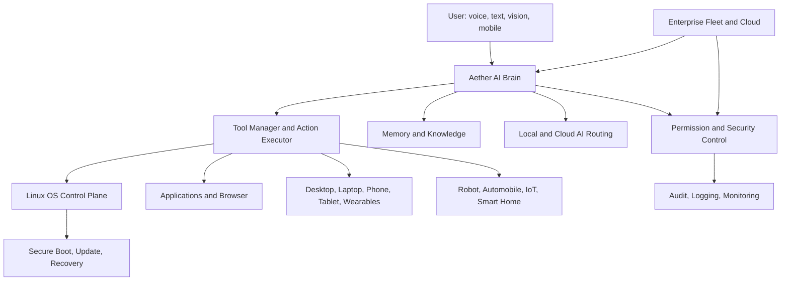
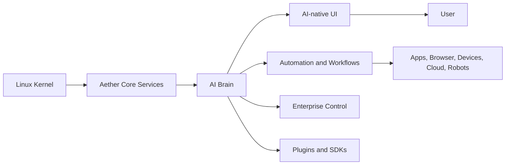
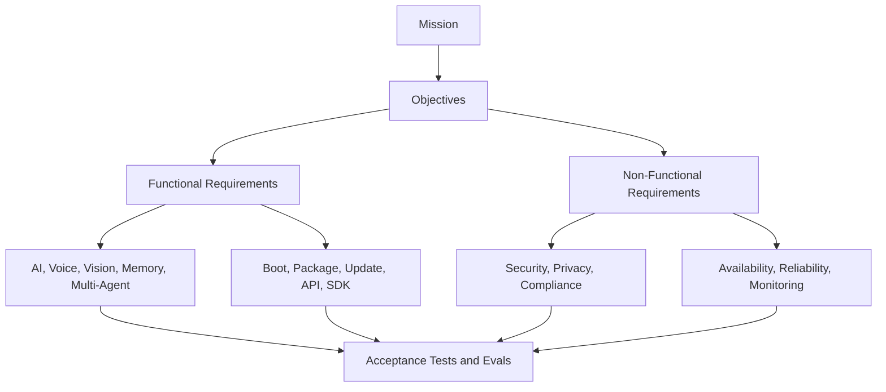

# Aether OS Software Requirements Specification

Document ID: AOS-SRS-001
Version: 0.1.0
Status: Foundational requirements baseline
Date: 2026-08-07
Standard style: ISO/IEC/IEEE 29148 aligned
Project: Aether OS

## Document Control

| Field | Value |
| --- | --- |
| Owner | Chief Requirements Engineer |
| Audience | Product, architecture, engineering, security, QA, compliance, operations, enterprise, OEM partners |
| Scope of this document | Software requirements for Aether OS as an AI-native operating system |
| Non-goal | This document does not define implementation code, pseudocode, or detailed software design |
| Source architecture | `docs/aether-os-architecture.md`; `docs/aether-os-ai-brain-architecture.md` |
| Requirement language | Normative requirements use "shall" |
| Requirement attributes | Requirement ID, description, priority, acceptance criteria, dependencies, risks, future considerations |

## Priority Classification

| Priority | Meaning | Release impact |
| --- | --- | --- |
| Critical | Required for minimum safe product operation or foundational platform integrity | Blocks release |
| High | Required for enterprise-grade product acceptance or primary AI-native experience | Blocks major release unless formally waived |
| Medium | Required for complete user, developer, or operational experience | May ship behind roadmap flag |
| Low | Desirable for differentiation, optimization, or long-term expansion | May defer without core impact |

## Verification Model

Every requirement shall be verified through at least one of: inspection, analysis, demonstration, automated test, manual test, security assessment, compliance audit, performance benchmark, or operational exercise. Acceptance criteria in this SRS define minimum verification evidence.

## Reference Architecture Overview

## 1. Executive Summary

Aether OS is an AI-native Linux-based operating system in which the AI Agent is the primary operating system interface. The operating system shall allow users to control computing environments naturally through voice, text, vision, automation, mobile devices, and future embodied interfaces. Aether OS shall support consumer, professional, developer, enterprise, cloud, edge, and future robotics use cases while preserving security, privacy, reliability, offline capability, and human control.

This SRS establishes the single source of truth for future requirements work. It defines measurable, testable requirements and cross-references the system and AI brain architecture documents.

## 2. Scope

In scope:

- AI-native operating system behavior for desktop, laptop, phone, tablet, robot, automobile, IoT, smart home, wearables, cloud, and enterprise contexts.
- Functional, non-functional, AI, voice, vision, memory, agent, plugin, automation, developer, mobile, browser, enterprise, cloud, offline, update, backup, disaster recovery, logging, monitoring, telemetry, configuration, package, boot, UI, API, SDK, and future expansion requirements.
- Requirements for secure OS control through AI-mediated permissions and auditable action execution.

Out of scope for this SRS:

- Source code.
- Pseudocode.
- Detailed implementation design.
- Commercial pricing.
- Brand identity.
- Hardware industrial design.

## 3. Objectives

| Objective ID | Objective | Success Metric |
| --- | --- | --- |
| OBJ-001 | Make the AI Agent the primary OS interaction model | At least 90 percent of core OS workflows can be completed through voice or text without launcher navigation |
| OBJ-002 | Preserve user and enterprise control | 100 percent of privileged actions require capability evaluation and audit evidence |
| OBJ-003 | Operate locally under degraded connectivity | Critical user workflows remain available without internet connectivity |
| OBJ-004 | Scale globally | Cloud services support tens of millions of users with regional isolation and tenant separation |
| OBJ-005 | Enable future device classes | Platform requirements do not assume desktop-only interaction or single-device ownership |

## 4. Product Vision

Aether OS shall evolve from an AI-native personal computer operating system into a cross-device intelligent environment. The user shall interact with an agent that understands intent, context, memory, applications, devices, browser state, enterprise policy, and safety constraints. The long-term vision is one coherent AI operating layer across personal devices, enterprise fleets, smart spaces, vehicles, robots, and cloud workspaces.

## 5. Product Perspective

Aether OS is positioned as a full operating system, not an application shell. It includes a Linux base, secure boot, update system, AI brain, model routing, memory, UI shell, package system, plugin system, developer platform, enterprise management, cloud services, mobile companion, and future robotics bridge.

## 6. Stakeholders

| Stakeholder | Interests | Primary Requirement Areas |
| --- | --- | --- |
| End users | Natural control, privacy, reliability, personalization | FR, AI, VOI, MEM, UI, PRI |
| Developers | APIs, SDKs, terminal control, app integration | DEV, API, SDK, PLG |
| Enterprise admins | Security, compliance, fleet management, audit | ENT, SEC, CMP, MON |
| Security teams | Least privilege, sandboxing, threat detection, audit | SEC, LOG, TEL, DSR |
| Accessibility users | Voice, vision, assistive UI, device flexibility | ACC, VOI, VIS, UI |
| OEM partners | Boot, updates, hardware profiles, recovery | BOT, UPD, PKG, DSR |
| Cloud operators | Scalability, monitoring, cost, availability | CLD, SCL, AVL, MON |
| Plugin vendors | Extension APIs, distribution, permissions | PLG, SDK, API |
| Robotics and IoT partners | Safe capability bridges and future device support | FUT, SEC, API |

## 7. Definitions

| Term | Definition |
| --- | --- |
| AI-native operating system | An operating system where AI-mediated intent, planning, memory, and action execution are primary interaction mechanisms |
| Agent | An AI service with a bounded role, scoped memory access, and capability-governed tool access |
| Capability | A named permission to read, modify, execute, observe, or control a resource |
| Cloud AI | AI model execution performed outside the local device |
| Local AI | AI model execution performed on the local device or trusted local network edge |
| Privileged action | Any action affecting security, system configuration, accounts, data deletion, remote access, installed software, payments, or device control |
| Tool | A typed callable capability exposed to the AI brain for observation or action |
| Workflow | A versioned sequence or graph of tasks with triggers, conditions, permissions, and recovery behavior |
| Memory | Governed records used for context, personalization, knowledge, projects, habits, and history |

## 8. Assumptions

| Assumption ID | Assumption |
| --- | --- |
| ASM-001 | Initial production targets include desktop and laptop devices before phone, automobile, robot, and wearables |
| ASM-002 | Enterprise customers require offline operation, regional data control, policy enforcement, and audit export |
| ASM-003 | Local AI hardware capabilities vary significantly across devices |
| ASM-004 | Some jurisdictions will require opt-in controls for biometric, voice, vision, telemetry, and memory features |
| ASM-005 | Cloud AI providers, model capabilities, and regulatory obligations will change over the product lifetime |

## 9. Constraints

| Constraint ID | Constraint |
| --- | --- |
| CON-001 | Aether OS shall use Linux as the operating system kernel family |
| CON-002 | Aether OS shall use AI-mediated permissions and auditable brokers for privileged control |
| CON-003 | Essential OS operation shall not require continuous internet connectivity |
| CON-004 | Public APIs shall be documented and versioned before release |
| CON-005 | The system shall support enterprise policy restrictions that disable cloud AI and telemetry |
| CON-006 | This SRS shall not prescribe source code or implementation algorithms |

## 10. User Classes

| User Class | Description | Primary Needs |
| --- | --- | --- |
| General user | Non-technical user controlling device through voice and text | Simplicity, safety, personalization |
| Professional user | Knowledge worker using apps, browser, documents, meetings, and automations | Productivity, reliability, memory |
| Developer | User building software on or for Aether OS | Tooling, APIs, terminal safety, project memory |
| Enterprise user | Managed employee or contractor | Policy compliance, secure collaboration |
| Administrator | Person managing devices, identity, updates, and policy | Fleet control, audit, remote support |
| Accessibility user | User relying on voice, screen reader, captions, or alternative input | Inclusive interaction, low friction |
| Plugin developer | Third party extending AI and OS functionality | SDKs, API contracts, distribution |
| Robotics or edge operator | Operator controlling robots, IoT, smart home, vehicle, or edge systems | Safety, remote state, bounded control |

## 11. User Personas

| Persona | Scenario | Success Criteria |
| --- | --- | --- |
| Maya, general user | Uses voice to find files, change settings, schedule tasks, and troubleshoot Wi-Fi | Completes core tasks without knowing system settings structure |
| Arjun, developer | Asks Aether to inspect a repo, run tests, explain failures, and prepare a change plan | Aether protects existing work and requires confirmation for destructive commands |
| Elena, enterprise admin | Rolls out policy, audits AI actions, and limits cloud model providers | Fleet compliance is visible and enforceable |
| Sam, accessibility user | Controls the device primarily through voice and assistive feedback | Critical workflows remain voice-accessible and screen-reader-accessible |
| Omar, field technician | Uses mobile companion to diagnose and remotely assist devices | Remote sessions require consent, audit, and secure channel verification |
| Nia, robotics operator | Asks Aether to plan robot tasks in simulation before execution | Physical actions require safety gates and external controller confirmation |

## Requirement Traceability Diagram

## 12. Functional Requirements

| Requirement ID | Description | Priority | Acceptance Criteria | Dependencies | Risks | Future Considerations |
| --- | --- | --- | --- | --- | --- | --- |
| AOS-SRS-FR-001 | Aether OS shall provide voice and text as first-class methods for controlling core operating system functions. | Critical | On a reference device, at least 90 percent of certified core workflows are completed by voice or text without launcher navigation. | AOS-SRS-VOI-001, AOS-SRS-UI-001, AOS-SRS-API-001 | Poor intent accuracy can reduce trust. | Extend to gesture, gaze, and embodied interfaces. |
| AOS-SRS-FR-002 | The AI Agent shall initiate, plan, execute, verify, and report multi-step tasks using governed tools. | Critical | A certified task suite shows plan creation, permission check, execution, verification, and response for 100 percent of privileged workflows. | AOS-SRS-AI-003, AOS-SRS-SEC-001, AOS-SRS-LOG-001 | Incomplete verification may produce false success. | Add formal workflow proofs for safety-critical domains. |
| AOS-SRS-FR-003 | Aether OS shall expose typed system-control tools for files, processes, packages, settings, network, display, audio, accounts, and power. | Critical | Tool catalog contains all listed domains; each tool has schema, capability, risk level, audit behavior, and contract tests. | AOS-SRS-API-001, AOS-SRS-SEC-002 | Tool misuse can damage user data. | Add automotive, robotics, and smart-home domains. |
| AOS-SRS-FR-004 | Aether OS shall support local applications, sandboxed applications, browser tasks, plugins, and cloud services as controllable resources. | High | Certification tests demonstrate read-only inspection and approved action execution across app, browser, plugin, and cloud resource classes. | AOS-SRS-PLG-001, AOS-SRS-BRO-001, AOS-SRS-CLD-001 | Inconsistent external APIs may break workflows. | Add vendor-provided automation manifests. |
| AOS-SRS-FR-005 | Aether OS shall maintain user, device, application, project, and workflow state across sessions. | High | After reboot, prior approved memories, open tasks, project context, and device profile are restored within documented retention policy. | AOS-SRS-MEM-001, AOS-SRS-BAK-001 | Stale state can cause wrong actions. | Add cross-device state federation. |
| AOS-SRS-FR-006 | Aether OS shall provide an emergency stop action that cancels active AI tasks and revokes current delegated grants. | Critical | Spoken, typed, and UI emergency stop tests cancel active tasks within 1 second and record audit evidence. | AOS-SRS-SEC-004, AOS-SRS-DSR-001 | Failure could permit harmful automation. | Extend emergency stop to robots and vehicles. |
| AOS-SRS-FR-007 | Aether OS shall provide user-visible explanations for privileged actions before execution and concise summaries after execution. | Critical | 100 percent of L3 and L4 risk actions display requested action, target resource, permission, reversibility, and expected result before execution. | AOS-SRS-SEC-003, AOS-SRS-UI-004 | Overly verbose prompts may cause prompt fatigue. | Add adaptive explanation depth by user expertise. |
| AOS-SRS-FR-008 | Aether OS shall support scheduled, recurring, event-triggered, and manually launched workflows. | High | Workflow test suite validates one-time, recurring, event-triggered, paused, resumed, cancelled, and failed workflow states. | AOS-SRS-AUT-001, AOS-SRS-AVL-004 | Duplicate workflows may cause repeated side effects. | Add marketplace workflow sharing. |
| AOS-SRS-FR-009 | Aether OS shall provide a mobile companion integration for approval, notification, remote assistance, and task handoff. | High | Paired mobile device receives approval requests, task updates, and handoff state through authenticated encrypted sessions. | AOS-SRS-MOB-001, AOS-SRS-SEC-006 | Stolen mobile device can become an attack path. | Support wearables and vehicle displays. |
| AOS-SRS-FR-010 | Aether OS shall provide enterprise enrollment, policy enforcement, remote support, audit export, and update-ring management. | High | Managed device passes enrollment, policy sync, restriction enforcement, remote support consent, and audit export tests. | AOS-SRS-ENT-001, AOS-SRS-CMP-001 | Enterprise policy conflicts may block user workflows. | Add delegated admin and multi-tenant hierarchy. |
| AOS-SRS-FR-011 | Aether OS shall provide a developer platform for building apps, plugins, tools, workflows, and AI integrations. | High | SDK release includes API docs, samples, contract tests, signing guidance, and local validation tools. | AOS-SRS-DEV-001, AOS-SRS-SDK-001 | Unstable APIs can fragment ecosystem. | Add certification marketplace pipeline. |
| AOS-SRS-FR-012 | Aether OS shall support offline operation for essential AI, OS control, memory retrieval, and recovery workflows. | Critical | Offline certification suite passes for login, voice/text core control, local memory retrieval, settings, files, diagnostics, and recovery. | AOS-SRS-OFF-001, AOS-SRS-AI-006 | Local model quality may be lower than cloud. | Add downloadable domain-specific offline packs. |

## 13. Non Functional Requirements

| Requirement ID | Description | Priority | Acceptance Criteria | Dependencies | Risks | Future Considerations |
| --- | --- | --- | --- | --- | --- | --- |
| AOS-SRS-NFR-001 | Aether OS shall preserve safety, privacy, and auditability over convenience for all privileged AI actions. | Critical | Security review confirms no privileged action path lacks permission check, audit event, and user or policy authority. | AOS-SRS-SEC-001, AOS-SRS-LOG-001 | Product pressure may weaken safety gates. | Apply same rule to future robots and vehicles. |
| AOS-SRS-NFR-002 | Aether OS shall maintain usable degraded behavior when AI models, cloud services, plugins, or external APIs fail. | Critical | Chaos testing demonstrates documented degraded modes for model outage, network loss, plugin crash, and API failure. | AOS-SRS-OFF-001, AOS-SRS-REL-003 | Users may misinterpret degraded answers as full capability. | Add automatic capability status indicators. |
| AOS-SRS-NFR-003 | Aether OS shall use measurable service-level objectives for latency, availability, reliability, and recovery. | High | Each production service has published SLOs, dashboards, alert thresholds, and release gates. | AOS-SRS-MON-001, AOS-SRS-TEL-001 | SLO gaps can hide regressions. | Add customer-specific enterprise SLO contracts. |
| AOS-SRS-NFR-004 | Aether OS shall support modular replacement of AI providers, local models, plugins, apps, and system services through versioned contracts. | High | Contract tests prove replacement of one provider or module without changing user-facing workflows. | AOS-SRS-API-002, AOS-SRS-SDK-003 | Excessive abstraction may slow delivery. | Add formal compatibility registry. |
| AOS-SRS-NFR-005 | Aether OS shall provide deterministic behavior for policy, permission, update, boot, package, backup, and recovery decisions. | Critical | Audit replay reproduces decisions for the listed domains using recorded inputs and policy versions. | AOS-SRS-SEC-002, AOS-SRS-UPD-001 | Model-generated decisions could bypass deterministic rules. | Add formally verified policy subsets. |

## 14. Performance Requirements

| Requirement ID | Description | Priority | Acceptance Criteria | Dependencies | Risks | Future Considerations |
| --- | --- | --- | --- | --- | --- | --- |
| AOS-SRS-PRF-001 | Aether OS shall acknowledge interactive voice or text input within 300 ms at the 95th percentile on certified reference hardware. | High | Performance suite measures acknowledgement latency across 1,000 mixed interactions with P95 <= 300 ms. | AOS-SRS-VOI-002, AOS-SRS-AI-001 | Heavy local models may starve UI response. | Add adaptive model preloading by usage pattern. |
| AOS-SRS-PRF-002 | Simple local OS-control commands shall complete within 2 seconds at the 95th percentile. | High | Certified commands for settings, file lookup, app launch, and status checks complete P95 <= 2 seconds. | AOS-SRS-FR-003, AOS-SRS-OFF-002 | Slow storage or hardware variance can violate target. | Define device-class-specific performance tiers. |
| AOS-SRS-PRF-003 | The AI shell shall sustain 60 frames per second for core UI interactions on certified desktop and laptop hardware. | High | UI benchmark shows P95 frame time <= 16.7 ms during chat, notifications, and system panels. | AOS-SRS-UI-002 | GPU driver issues may degrade frame pacing. | Add 90 Hz and 120 Hz tiers for premium devices. |
| AOS-SRS-PRF-004 | Local memory retrieval for interactive tasks shall return ranked results within 100 ms at the 95th percentile for 100,000 user memory records. | High | Memory benchmark with 100,000 records achieves P95 <= 100 ms for hybrid retrieval. | AOS-SRS-MEM-004 | Poor indexing can cause slow personalization. | Add tiered indexes for enterprise knowledge. |
| AOS-SRS-PRF-005 | Cloud AI routing shall produce provider selection within 150 ms at the 95th percentile excluding provider inference time. | Medium | Router benchmark across regional providers demonstrates P95 <= 150 ms routing decision. | AOS-SRS-CLD-002 | Provider health checks can become stale. | Add predictive routing from fleet telemetry. |

## 15. Availability Requirements

| Requirement ID | Description | Priority | Acceptance Criteria | Dependencies | Risks | Future Considerations |
| --- | --- | --- | --- | --- | --- | --- |
| AOS-SRS-AVL-001 | Local core OS control shall remain available when cloud services are unreachable. | Critical | Offline tests confirm local login, settings, files, app launch, diagnostics, and recovery without network. | AOS-SRS-OFF-001, AOS-SRS-FR-012 | Overdependence on cloud models can break basics. | Add local-first certification badge per feature. |
| AOS-SRS-AVL-002 | Cloud AI routing services shall provide 99.95 percent monthly availability per production region. | High | Production monitoring reports monthly regional availability >= 99.95 percent. | AOS-SRS-CLD-001, AOS-SRS-MON-001 | Provider outages can reduce effective availability. | Add multi-provider active-active routing. |
| AOS-SRS-AVL-003 | Enterprise policy evaluation shall remain available locally for at least 30 days after last successful policy sync. | Critical | Managed device enforces cached signed policy for 30 days offline and records sync staleness. | AOS-SRS-ENT-002, AOS-SRS-SEC-002 | Stale policy may not reflect emergency blocks. | Add emergency revocation channel through mobile network. |
| AOS-SRS-AVL-004 | Scheduled workflows shall survive reboot, suspend, service restart, and network interruption. | High | Workflow durability tests preserve state and resume or mark missed runs according to policy. | AOS-SRS-AUT-002, AOS-SRS-REL-002 | Duplicate execution can cause side effects. | Add exactly-once semantics for more tool classes. |
| AOS-SRS-AVL-005 | Critical security, audit, update, and recovery services shall start before user AI control is enabled. | Critical | Boot verification blocks AI control until required services report healthy or documented safe mode. | AOS-SRS-BOT-003, AOS-SRS-SEC-001 | Users may perceive slow boot. | Add progressive shell readiness indicators. |

## 16. Reliability Requirements

| Requirement ID | Description | Priority | Acceptance Criteria | Dependencies | Risks | Future Considerations |
| --- | --- | --- | --- | --- | --- | --- |
| AOS-SRS-REL-001 | Aether OS shall verify postconditions for all privileged AI-executed actions. | Critical | Test suite confirms each privileged tool defines and validates expected postconditions before reporting success. | AOS-SRS-FR-002, AOS-SRS-SEC-003 | Verification gaps can hide partial failure. | Add independent verifier agents for high-risk domains. |
| AOS-SRS-REL-002 | Long-running tasks shall be checkpointed before each non-idempotent or privileged step. | Critical | Workflow tests demonstrate restart from checkpoint without repeating completed non-idempotent side effects. | AOS-SRS-AUT-003, AOS-SRS-DSR-001 | Bad checkpoint data can corrupt recovery. | Add cryptographic checkpoint integrity. |
| AOS-SRS-REL-003 | The AI brain shall recover from model, plugin, service, and tool crashes without corrupting task state. | High | Fault injection tests crash each component and verify task state is recovered or safely failed. | AOS-SRS-NFR-002, AOS-SRS-DSR-001 | Crash loops can degrade user trust. | Add automatic component quarantine. |
| AOS-SRS-REL-004 | Memory indexes shall be rebuildable from authoritative encrypted memory records. | High | Corruption test deletes vector and full-text indexes; rebuild completes with zero lost authoritative records. | AOS-SRS-MEM-005, AOS-SRS-BAK-002 | Rebuild may be slow for large profiles. | Add background incremental snapshots. |
| AOS-SRS-REL-005 | Aether OS shall prevent duplicate execution of user-visible side effects after retries. | Critical | Retry tests verify idempotency keys or explicit duplicate-prevention evidence for package, file, message, and payment-adjacent actions. | AOS-SRS-API-004, AOS-SRS-AUT-004 | External APIs may not support idempotency. | Add compensating transaction registry. |

## 17. Scalability Requirements

| Requirement ID | Description | Priority | Acceptance Criteria | Dependencies | Risks | Future Considerations |
| --- | --- | --- | --- | --- | --- | --- |
| AOS-SRS-SCL-001 | Cloud services shall support horizontal scaling for at least 10 million monthly active users in the target architecture. | High | Load model and staged tests demonstrate capacity plan for 10 million MAU with regional sharding. | AOS-SRS-CLD-001, AOS-SRS-MON-002 | Premature scale assumptions may increase cost. | Extend architecture to 100 million MAU. |
| AOS-SRS-SCL-002 | Tenant data, policy, memory sync, telemetry, and audit export shall be shardable by region and tenant. | Critical | Architecture review and integration tests verify tenant isolation and region-specific storage routing. | AOS-SRS-ENT-003, AOS-SRS-PRI-004 | Data residency violations can block enterprise sales. | Add sovereign cloud deployments. |
| AOS-SRS-SCL-003 | Local memory shall support at least 1 million indexed user records per power-user profile without functional degradation. | Medium | Memory scale test validates indexing, retrieval, expiration, and backup for 1 million records. | AOS-SRS-MEM-004, AOS-SRS-PRF-004 | Storage pressure can harm low-end devices. | Add tiered archival memory. |
| AOS-SRS-SCL-004 | Plugin and workflow registries shall support at least 100,000 signed public extensions and 10,000 enterprise-private extensions per tenant. | Medium | Registry scale test indexes, searches, validates, and revokes extensions at stated counts. | AOS-SRS-PLG-004, AOS-SRS-SDK-004 | Marketplace abuse can grow with ecosystem. | Add automated reputation scoring. |
| AOS-SRS-SCL-005 | Model routing shall support at least 1,000 provider, model, region, and policy combinations without manual routing rules per combination. | High | Router test loads 1,000 combinations and produces policy-compliant selections within performance target. | AOS-SRS-CLD-002, AOS-SRS-AI-007 | Complex routing can become hard to debug. | Add explainable routing diagnostics. |

## 18. Maintainability Requirements

| Requirement ID | Description | Priority | Acceptance Criteria | Dependencies | Risks | Future Considerations |
| --- | --- | --- | --- | --- | --- | --- |
| AOS-SRS-MNT-001 | Each production module shall expose versioned contracts and documented ownership. | Critical | Release review verifies owner, API version, changelog, support policy, and tests for each module. | AOS-SRS-API-002, AOS-SRS-SDK-001 | Orphan modules slow incident response. | Add automated ownership routing. |
| AOS-SRS-MNT-002 | Public APIs shall remain backward compatible within a major version. | High | Compatibility tests pass for previous supported minor versions before release. | AOS-SRS-API-003 | API drift can break apps and plugins. | Add formal deprecation service. |
| AOS-SRS-MNT-003 | Requirements shall be traceable to architecture, design, tests, and release evidence. | Critical | Requirements management audit samples 100 requirements and finds complete trace links for each. | AOS-SRS-TEL-004 | Missing traceability can block compliance. | Integrate requirements with CI gates. |
| AOS-SRS-MNT-004 | Configuration, policy, workflow, and plugin schemas shall have migration plans before breaking changes. | High | Release checklist blocks schema changes without migration tests and rollback evidence. | AOS-SRS-CFG-004, AOS-SRS-PLG-005 | Migration failure can corrupt user state. | Add schema compatibility simulator. |
| AOS-SRS-MNT-005 | AI behavior changes shall be evaluated before release using regression suites for task success, safety, privacy, and latency. | Critical | AI release gates show no critical regression in approved eval suites. | AOS-SRS-AI-010, AOS-SRS-TEL-005 | Model behavior can regress without code changes. | Add continuous live shadow evaluation with consent. |

## 19. Security Requirements

| Requirement ID | Description | Priority | Acceptance Criteria | Dependencies | Risks | Future Considerations |
| --- | --- | --- | --- | --- | --- | --- |
| AOS-SRS-SEC-001 | Aether OS shall enforce capability-based authorization for every privileged AI, app, plugin, workflow, browser, mobile, and remote action. | Critical | Security tests verify no privileged action path executes without a capability decision and audit event. | AOS-SRS-FR-002, AOS-SRS-API-001 | Authorization bypass can compromise the system. | Extend capabilities to robots, vehicles, and smart homes. |
| AOS-SRS-SEC-002 | Permission decisions shall be deterministic and replayable from actor, capability, resource, policy, context, and time inputs. | Critical | Audit replay reproduces 100 percent of sampled permission decisions. | AOS-SRS-NFR-005, AOS-SRS-LOG-002 | Non-determinism can undermine compliance. | Add formally verified policy language. |
| AOS-SRS-SEC-003 | L3 and L4 risk actions shall require explicit user or administrator confirmation unless pre-approved by signed enterprise policy. | Critical | Prompt tests verify confirmation is required for all certified L3 and L4 workflows. | AOS-SRS-FR-007, AOS-SRS-ENT-002 | Prompt fatigue may cause unsafe approvals. | Add risk-adaptive approval mechanisms. |
| AOS-SRS-SEC-004 | Emergency stop shall revoke active delegated grants and halt running AI tasks. | Critical | Emergency stop test cancels active tasks and revokes grants within 1 second. | AOS-SRS-FR-006, AOS-SRS-DSR-001 | Some external side effects may be irreversible. | Add cross-device emergency stop propagation. |
| AOS-SRS-SEC-005 | Aether OS shall isolate apps, plugins, browser automation, local model execution, and high-risk tools using sandbox boundaries. | Critical | Penetration tests verify sandbox profiles block unauthorized filesystem, network, screen, microphone, and process access. | AOS-SRS-PLG-002, AOS-SRS-PKG-004 | Sandbox escape can expose user data. | Add hardware-backed isolation for high-risk workloads. |
| AOS-SRS-SEC-006 | Remote control and mobile companion sessions shall use strong device identity, encrypted transport, scoped grants, and visible session indicators. | Critical | Remote support tests verify pairing, authentication, encryption, consent, indicator, revocation, and audit. | AOS-SRS-MOB-001, AOS-SRS-ENT-006 | Remote access is a high-value attack path. | Add enterprise just-in-time access workflows. |
| AOS-SRS-SEC-007 | Browser and document content shall be treated as untrusted input and shall not be allowed to issue hidden instructions to the AI brain. | Critical | Prompt-injection test suite demonstrates blocked or isolated instructions from web pages, files, emails, and terminal output. | AOS-SRS-BRO-003, AOS-SRS-AI-008 | Prompt injection can exfiltrate data or alter actions. | Add content-origin labeling in all model contexts. |
| AOS-SRS-SEC-008 | Secrets shall be exposed to tools only as scoped handles and shall never be included in model prompts, logs, telemetry, or plugin-visible data. | Critical | Secret scanning and red-team tests find zero raw secret exposure across model, log, telemetry, and plugin paths. | AOS-SRS-PRI-003, AOS-SRS-LOG-003 | Credential leakage can cause account compromise. | Add confidential computing for selected cloud operations. |

## 20. Privacy Requirements

| Requirement ID | Description | Priority | Acceptance Criteria | Dependencies | Risks | Future Considerations |
| --- | --- | --- | --- | --- | --- | --- |
| AOS-SRS-PRI-001 | Aether OS shall classify data sensitivity before memory storage, model routing, telemetry export, or plugin exposure. | Critical | Privacy tests verify classification occurs for voice, text, files, browser, screen, memory, logs, and telemetry inputs. | AOS-SRS-MEM-002, AOS-SRS-CLD-003 | Misclassification can leak private data. | Add jurisdiction-specific classifiers. |
| AOS-SRS-PRI-002 | Users shall be able to inspect, edit, pause, export, and delete personal memory. | Critical | UI and API tests complete inspect, edit, pause, export, and delete flows for every personal memory type. | AOS-SRS-MEM-001, AOS-SRS-UI-006 | Complex memory may be hard to explain. | Add natural-language memory governance. |
| AOS-SRS-PRI-003 | Aether OS shall prevent raw secrets, credentials, tokens, private keys, and biometric templates from being stored in AI memory. | Critical | Automated tests attempt to store sensitive materials and verify rejection or secure handle substitution. | AOS-SRS-SEC-008, AOS-SRS-MEM-006 | False negatives can create durable leaks. | Add hardware-backed secret classification. |
| AOS-SRS-PRI-004 | Cloud AI use shall be controlled by user and enterprise policy at data-class, provider, region, and task-type granularity. | Critical | Policy tests block or allow cloud model calls according to configured data class, provider, region, and task. | AOS-SRS-CLD-003, AOS-SRS-ENT-004 | Provider policy mismatch can violate contracts. | Add per-record cloud routing consent. |
| AOS-SRS-PRI-005 | Lock-screen, remote, notification, and mobile surfaces shall hide sensitive content unless policy explicitly permits display. | High | UI tests verify sensitive prompts, messages, files, and memory are redacted on restricted surfaces. | AOS-SRS-UI-007, AOS-SRS-MOB-003 | Over-redaction can reduce usability. | Add user-tunable privacy previews. |

## 21. Compliance Requirements

| Requirement ID | Description | Priority | Acceptance Criteria | Dependencies | Risks | Future Considerations |
| --- | --- | --- | --- | --- | --- | --- |
| AOS-SRS-CMP-001 | Aether OS shall maintain auditable evidence for security, privacy, update, identity, access, and AI action controls. | Critical | Compliance audit samples evidence records and maps each to requirement, policy, actor, time, and outcome. | AOS-SRS-LOG-001, AOS-SRS-SEC-001 | Missing evidence can block certification. | Add automated compliance report generation. |
| AOS-SRS-CMP-002 | Aether OS shall support enterprise data retention and deletion policies for logs, telemetry, memory, backups, and audit exports. | High | Tenant policy tests verify configured retention and deletion across all listed data classes. | AOS-SRS-PRI-002, AOS-SRS-BAK-003 | Conflicting legal holds may complicate deletion. | Add legal hold workflows. |
| AOS-SRS-CMP-003 | Aether OS shall produce software bill of materials, artifact signatures, provenance, and vulnerability reports for production releases. | Critical | Release artifacts include SBOM, signatures, provenance, and vulnerability status before publication. | AOS-SRS-UPD-003, AOS-SRS-PKG-003 | Supply-chain gaps can compromise updates. | Add customer-verifiable provenance portals. |
| AOS-SRS-CMP-004 | Aether OS shall support jurisdiction-specific privacy and data residency configuration for enterprise tenants. | High | Test tenants in at least three regions enforce region-specific storage and routing policies. | AOS-SRS-SCL-002, AOS-SRS-CLD-004 | Incorrect routing can violate law or contract. | Add sovereign and air-gapped cloud profiles. |
| AOS-SRS-CMP-005 | Aether OS shall maintain release traceability from requirements to tests and shipped artifacts. | Critical | Release audit verifies every Critical and High requirement has passing evidence or approved waiver. | AOS-SRS-MNT-003, AOS-SRS-TEL-004 | Untraced changes can create unknown risk. | Add automated requirements-to-test dashboards. |

## 22. Accessibility Requirements

| Requirement ID | Description | Priority | Acceptance Criteria | Dependencies | Risks | Future Considerations |
| --- | --- | --- | --- | --- | --- | --- |
| AOS-SRS-ACC-001 | Core OS workflows shall be operable by voice, keyboard, and screen reader without requiring pointer input. | Critical | Accessibility test suite completes login, settings, file search, app launch, notifications, and shutdown without pointer input. | AOS-SRS-VOI-001, AOS-SRS-UI-003 | Some third-party apps may not expose accessible controls. | Add AI-mediated accessibility adapters. |
| AOS-SRS-ACC-002 | Visual UI components shall expose accessible names, roles, states, focus order, and keyboard actions. | High | Automated accessibility inspection reports zero Critical violations in certified UI components. | AOS-SRS-UI-003 | Custom UI may miss semantic metadata. | Add design-system accessibility enforcement. |
| AOS-SRS-ACC-003 | Voice interaction shall support captions, transcript review, correction, and confirmation for critical actions. | High | Voice tests show transcript visibility and correction before all L3 and L4 voice actions. | AOS-SRS-VOI-004, AOS-SRS-SEC-003 | Misheard commands can cause unsafe actions. | Add personalized speech correction models. |
| AOS-SRS-ACC-004 | Aether OS shall support reduced motion, high contrast, text scaling, color-blind-safe status indicators, and non-audio alerts. | High | UI test matrix verifies each accessibility setting changes certified shell surfaces consistently. | AOS-SRS-UI-005 | Inconsistent third-party theming may reduce compliance. | Add plugin accessibility certification. |
| AOS-SRS-ACC-005 | AI responses shall offer adjustable verbosity and reading level without removing required safety information. | Medium | User preference tests verify concise, standard, detailed, and simplified modes preserve mandatory warnings. | AOS-SRS-AI-005, AOS-SRS-UI-004 | Oversimplification may omit risks. | Add domain-specific accessible explanations. |

## 23. Internationalization

| Requirement ID | Description | Priority | Acceptance Criteria | Dependencies | Risks | Future Considerations |
| --- | --- | --- | --- | --- | --- | --- |
| AOS-SRS-INTL-001 | Aether OS shall separate user-facing strings, locale data, date/time formats, number formats, and pluralization from product logic. | High | Internationalization scan reports no hard-coded user-facing strings in certified shell and system services. | AOS-SRS-LOC-001, AOS-SRS-UI-001 | Hard-coded strings increase localization cost. | Add pseudo-localization gate in CI. |
| AOS-SRS-INTL-002 | The AI brain shall detect and preserve user language across voice, text, memory, and response surfaces. | High | Multilingual tests verify correct language continuity across 20 supported locales. | AOS-SRS-AI-001, AOS-SRS-VOI-003 | Mixed-language users may get inconsistent responses. | Add per-context language preference memory. |
| AOS-SRS-INTL-003 | APIs, logs, and requirements-visible identifiers shall remain locale-neutral and stable. | Critical | API contract tests verify IDs, enum values, error codes, and audit fields do not change by locale. | AOS-SRS-API-002, AOS-SRS-LOG-002 | Localized machine identifiers can break integrations. | Add localization only at presentation layer. |
| AOS-SRS-INTL-004 | Text layout shall support right-to-left scripts and complex text shaping in shell, notifications, and AI surfaces. | Medium | UI tests render and interact with Arabic, Hebrew, Devanagari, Thai, and CJK text without clipping or ordering defects. | AOS-SRS-UI-002, AOS-SRS-LOC-002 | Layout bugs can block regional launches. | Add locale-specific typography packs. |

## 24. Localization

| Requirement ID | Description | Priority | Acceptance Criteria | Dependencies | Risks | Future Considerations |
| --- | --- | --- | --- | --- | --- | --- |
| AOS-SRS-LOC-001 | Aether OS shall support release-time localization packages independent of OS core updates. | High | Locale package install, update, rollback, and removal tests pass without modifying core OS image. | AOS-SRS-PKG-001, AOS-SRS-UPD-002 | Mismatched locale package versions can break UI. | Add enterprise-approved locale catalogs. |
| AOS-SRS-LOC-002 | Localized AI responses shall preserve safety, permission, privacy, and compliance meaning. | Critical | Translation review and automated tests verify mandatory warnings and consent prompts keep equivalent meaning in supported locales. | AOS-SRS-SEC-003, AOS-SRS-ACC-005 | Incorrect translation can create unsafe consent. | Add certified legal-language packs. |
| AOS-SRS-LOC-003 | Voice localization shall include language, accent, pronunciation, dictation, and text-to-speech quality targets per supported locale. | High | Locale certification reports ASR word error rate and TTS intelligibility within published thresholds. | AOS-SRS-VOI-003 | Low-resource languages may lag quality targets. | Add community and enterprise acoustic packs. |
| AOS-SRS-LOC-004 | Enterprise tenants shall be able to select allowed UI, voice, and AI response locales. | Medium | Policy tests restrict locale availability and fallback behavior according to tenant configuration. | AOS-SRS-ENT-004, AOS-SRS-CFG-002 | Locale restriction may reduce accessibility. | Add per-user exception requests. |

## 25. AI Requirements

| Requirement ID | Description | Priority | Acceptance Criteria | Dependencies | Risks | Future Considerations |
| --- | --- | --- | --- | --- | --- | --- |
| AOS-SRS-AI-001 | The AI brain shall understand natural language commands, questions, corrections, cancellations, and references across voice and text. | Critical | Intent eval suite achieves target accuracy for command, question, correction, cancellation, and reference classes across supported locales. | AOS-SRS-INTL-002, AOS-SRS-FR-001 | Misunderstanding can cause unsafe or frustrating behavior. | Add multimodal intent fusion. |
| AOS-SRS-AI-002 | The AI brain shall maintain short-term context for active conversations, visible references, active app state, and running tasks. | Critical | Context tests resolve references such as "this", "that file", and "the previous step" correctly in certified workflows. | AOS-SRS-MEM-001, AOS-SRS-VIS-002 | Stale context can target wrong resource. | Add context freshness indicators. |
| AOS-SRS-AI-003 | The AI brain shall create multi-step plans with dependencies, permissions, preflight checks, verification, and recovery strategy. | Critical | Plan evaluation suite verifies required fields for 100 percent of privileged and multi-step workflows. | AOS-SRS-FR-002, AOS-SRS-REL-002 | Bad plans may cause partial side effects. | Add plan simulation for high-risk domains. |
| AOS-SRS-AI-004 | The AI brain shall distinguish instructions from trusted user input and untrusted content inside websites, documents, terminal output, and messages. | Critical | Prompt-injection eval suite blocks untrusted content from changing system instructions or permissions. | AOS-SRS-SEC-007, AOS-SRS-BRO-003 | Sophisticated attacks may bypass classifiers. | Add origin-aware model context protocols. |
| AOS-SRS-AI-005 | The AI brain shall provide user-facing responses that are accurate, concise, context-aware, and explicit about uncertainty. | High | Response eval suite measures factuality, task relevance, uncertainty disclosure, and safety prompt quality above release thresholds. | AOS-SRS-MEM-004, AOS-SRS-ACC-005 | Overconfident answers can mislead users. | Add per-domain verification policies. |
| AOS-SRS-AI-006 | The AI brain shall support offline mode for essential OS commands using local models or deterministic command grammars. | Critical | Offline AI tests pass for the certified essential command set without cloud connectivity. | AOS-SRS-OFF-002, AOS-SRS-VOI-005 | Offline quality may vary by hardware. | Add device-class offline model packs. |
| AOS-SRS-AI-007 | The AI brain shall route model requests between local and cloud providers based on privacy, policy, capability, latency, cost, and availability. | Critical | Routing tests verify correct decisions for at least 100 policy and availability scenarios. | AOS-SRS-CLD-002, AOS-SRS-PRI-004 | Wrong routing can leak data or increase cost. | Add tenant-specific routing optimization. |
| AOS-SRS-AI-008 | The AI brain shall produce audit-safe reasoning summaries for privileged actions without exposing hidden internal prompts or sensitive data. | High | Audit records include rationale, assumptions, risk, and evidence while secret and prompt scans pass. | AOS-SRS-LOG-001, AOS-SRS-SEC-008 | Inadequate rationale can reduce auditability. | Add standardized decision explanation schema. |
| AOS-SRS-AI-009 | The AI brain shall learn user habits only through explicit consent or policy-allowed low-sensitivity signals. | High | Learning tests verify opt-in state, signal class, memory write proposal, and user editability. | AOS-SRS-MEM-007, AOS-SRS-PRI-002 | Invasive personalization can violate trust. | Add privacy-preserving federated learning. |
| AOS-SRS-AI-010 | AI models, prompts, policies, tools, and agent graphs shall be versioned and evaluated before release. | Critical | Release gate blocks model or prompt updates without version metadata, eval results, rollback plan, and owner approval. | AOS-SRS-MNT-005, AOS-SRS-UPD-004 | Unreviewed model changes can regress safety. | Add live canary evals with opt-in telemetry. |

## 26. Voice Requirements

| Requirement ID | Description | Priority | Acceptance Criteria | Dependencies | Risks | Future Considerations |
| --- | --- | --- | --- | --- | --- | --- |
| AOS-SRS-VOI-001 | Aether OS shall provide voice-first interaction for login-adjacent safe commands, OS navigation, settings, files, apps, notifications, and AI conversation. | Critical | Voice certification completes listed domains using speech as primary input. | AOS-SRS-FR-001, AOS-SRS-ACC-001 | Voice-only failures can exclude users. | Add vehicle and wearable voice profiles. |
| AOS-SRS-VOI-002 | Wake-word and push-to-talk activation shall provide visible or audible privacy indication before command processing. | Critical | Privacy tests verify indicator appears before transcript is processed and remains visible during microphone use. | AOS-SRS-PRI-001, AOS-SRS-UI-007 | Users may fear hidden listening. | Add hardware LED integration where available. |
| AOS-SRS-VOI-003 | Speech recognition shall meet published word error rate targets per supported locale and acoustic condition. | High | Locale certification reports WER <= 8 percent quiet, <= 15 percent office noise, and documented fallback for harsher conditions. | AOS-SRS-LOC-003, AOS-SRS-PRF-001 | Accent and noise bias can reduce fairness. | Add personalized local adaptation. |
| AOS-SRS-VOI-004 | The system shall require transcript confirmation or equivalent review before L3 and L4 voice-initiated actions. | Critical | Tests verify no L3 or L4 voice action executes without visible or spoken confirmation of interpreted action. | AOS-SRS-SEC-003, AOS-SRS-ACC-003 | Confirmation friction may reduce adoption. | Add trusted-device multi-factor confirmation. |
| AOS-SRS-VOI-005 | Offline voice mode shall support a certified set of emergency, settings, file, app, accessibility, and recovery commands. | Critical | Airplane-mode tests pass for the offline command set on each supported device class. | AOS-SRS-OFF-002, AOS-SRS-AI-006 | Large language packs may consume storage. | Add modular offline language packs. |
| AOS-SRS-VOI-006 | Voice output shall support interruption, replay, speed control, captions, and quiet mode. | Medium | User tests verify barge-in, replay, speech speed, captions, and silent notification alternatives. | AOS-SRS-ACC-003, AOS-SRS-UI-005 | Audio conflicts can disrupt meetings. | Add context-aware audio etiquette. |

## 27. Vision Requirements

| Requirement ID | Description | Priority | Acceptance Criteria | Dependencies | Risks | Future Considerations |
| --- | --- | --- | --- | --- | --- | --- |
| AOS-SRS-VIS-001 | Aether OS shall support user-approved screen, window, image, document, and camera interpretation for AI assistance. | High | Permission tests verify each visual source requires correct scope and produces context with provenance. | AOS-SRS-PRI-001, AOS-SRS-SEC-001 | Visual data may expose sensitive information. | Add hardware privacy controls. |
| AOS-SRS-VIS-002 | Vision context shall support references such as "this button", "that chart", "the selected image", and "the error on screen". | High | Visual grounding evals resolve references with published accuracy thresholds across certified UI and document scenarios. | AOS-SRS-AI-002, AOS-SRS-UI-002 | Incorrect grounding can click or modify wrong target. | Add multimodal verification before action. |
| AOS-SRS-VIS-003 | Protected content, sensitive windows, password fields, payment fields, and enterprise-restricted surfaces shall be redacted before AI processing. | Critical | DLP tests verify restricted visual content is blocked or redacted locally before model routing. | AOS-SRS-PRI-005, AOS-SRS-SEC-008 | Redaction gaps can leak secrets. | Add app-declared protected regions. |
| AOS-SRS-VIS-004 | Visual postcondition verification shall be available for browser, app, document, and UI automation workflows. | High | Automation tests compare expected visual state against captured post-action state before reporting success. | AOS-SRS-REL-001, AOS-SRS-BRO-004 | Visual similarity can produce false positives. | Combine visual, API, and accessibility evidence. |
| AOS-SRS-VIS-005 | Vision features shall support local processing for sensitive screen and camera contexts unless policy permits cloud routing. | Critical | Routing tests block cloud vision calls for sensitive data classes and allow local fallback. | AOS-SRS-CLD-003, AOS-SRS-PRI-004 | Local models may be less accurate. | Add local accelerator model packs. |

## 28. Memory Requirements

| Requirement ID | Description | Priority | Acceptance Criteria | Dependencies | Risks | Future Considerations |
| --- | --- | --- | --- | --- | --- | --- |
| AOS-SRS-MEM-001 | Aether OS shall maintain short-term, long-term, semantic, procedural, conversation, vector, user, device, application, project, and graph memory types. | Critical | Memory API and UI tests create, retrieve, update, and delete each listed memory type. | AOS-SRS-AI-002, AOS-SRS-PRI-002 | Memory complexity can confuse users. | Add visual memory map. |
| AOS-SRS-MEM-002 | Every memory record shall include owner, scope, type, source, confidence, sensitivity, timestamps, retention, sync policy, and provenance. | Critical | Schema validation rejects memory records missing required metadata. | AOS-SRS-PRI-001, AOS-SRS-CMP-002 | Missing metadata can break deletion or compliance. | Add verifiable memory lineage. |
| AOS-SRS-MEM-003 | Memory retrieval shall enforce access control before ranking or model context assembly. | Critical | Security tests verify unauthorized memories are excluded from retrieval results and model context. | AOS-SRS-SEC-001, AOS-SRS-PRI-004 | Retrieval leakage can expose unrelated private data. | Add confidential retrieval indexes. |
| AOS-SRS-MEM-004 | Memory retrieval shall use hybrid ranking across recency, lexical match, vector similarity, graph links, confidence, and task relevance. | High | Retrieval eval suite meets published relevance targets on user, project, and app memory datasets. | AOS-SRS-PRF-004, AOS-SRS-AI-005 | Poor ranking causes wrong personalization. | Add per-user ranking adaptation. |
| AOS-SRS-MEM-005 | Memory indexes shall support rebuild, integrity check, compaction, and corruption recovery. | High | Corruption tests rebuild indexes and verify record counts, retrieval quality, and deletion tombstones. | AOS-SRS-REL-004, AOS-SRS-BAK-002 | Large rebuilds can affect performance. | Add incremental index snapshots. |
| AOS-SRS-MEM-006 | Memory deletion shall remove raw records, summaries, embeddings, graph edges, full-text indexes, cached context, and synced replicas where policy allows. | Critical | Deletion verification test confirms no deleted memory appears in retrieval, export, backup restore, or sync replica. | AOS-SRS-PRI-002, AOS-SRS-BAK-003 | Backups can reintroduce deleted memory. | Add cryptographic erasure proofs. |
| AOS-SRS-MEM-007 | Inferred memories and learned habits shall remain distinguishable from explicit user-provided memories. | High | UI and API tests show source and confidence labels for explicit and inferred memory records. | AOS-SRS-AI-009, AOS-SRS-PRI-002 | Users may treat inferred memory as fact. | Add approval workflow for habit promotion. |

## 29. Multi-Agent Requirements

| Requirement ID | Description | Priority | Acceptance Criteria | Dependencies | Risks | Future Considerations |
| --- | --- | --- | --- | --- | --- | --- |
| AOS-SRS-MAG-001 | Aether OS shall support supervised coordination of Main, IT, Developer, Research, Creative, Security, Automation, Vision, and Browser agents. | High | Multi-agent tests instantiate each agent role and complete delegated tasks with traceable outputs. | AOS-SRS-AI-003, AOS-SRS-API-001 | Agent conflicts can delay tasks. | Add custom enterprise agents. |
| AOS-SRS-MAG-002 | Specialist agents shall access memory, tools, context, and APIs only through scoped brokered interfaces. | Critical | Security tests verify agents cannot bypass memory, permission, or tool brokers. | AOS-SRS-SEC-001, AOS-SRS-MEM-003 | Overbroad shared memory can leak data. | Add formal agent capability manifests. |
| AOS-SRS-MAG-003 | The Security Agent shall have veto authority over high-risk plans before execution. | Critical | Test plans flagged unsafe by Security Agent are blocked unless a documented recovery admin override exists. | AOS-SRS-SEC-003, AOS-SRS-AI-004 | False positives may block work. | Add appeal and review workflows. |
| AOS-SRS-MAG-004 | Multi-agent collaboration shall preserve a shared task trace with agent requests, evidence, decisions, and final result. | High | Trace inspection verifies every agent contribution is linked to task ID, actor, time, and outcome. | AOS-SRS-LOG-001, AOS-SRS-TEL-004 | Missing trace can make failures hard to debug. | Add task graph visualization. |
| AOS-SRS-MAG-005 | Agent priority rules shall prevent background agents from starving interactive user tasks or emergency actions. | High | Scheduler tests show P0 and P1 tasks preempt P2 through P5 workloads within defined latency thresholds. | AOS-SRS-AUT-002, AOS-SRS-PRF-001 | Priority inversion can harm responsiveness. | Add fleet-wide agent resource policy. |

## 30. Plugin Requirements

| Requirement ID | Description | Priority | Acceptance Criteria | Dependencies | Risks | Future Considerations |
| --- | --- | --- | --- | --- | --- | --- |
| AOS-SRS-PLG-001 | Aether OS shall support plugins that extend tools, workflows, context providers, UI surfaces, and integrations through versioned manifests. | High | Plugin certification installs one plugin per extension type and verifies manifest, permissions, and version compatibility. | AOS-SRS-SDK-001, AOS-SRS-API-002 | Poor plugin contracts can fragment ecosystem. | Add marketplace categories and quality scores. |
| AOS-SRS-PLG-002 | Plugins shall execute with least privilege in a sandbox and receive only declared, granted capabilities. | Critical | Sandbox tests verify plugins cannot access undeclared files, network, screen, microphone, memory, or tools. | AOS-SRS-SEC-005, AOS-SRS-PRI-001 | Plugin escape can compromise user data. | Add microVM tier for high-risk plugins. |
| AOS-SRS-PLG-003 | Plugin installation, update, execution, and removal shall require signature verification and revocation checks. | Critical | Package tests reject unsigned, expired, revoked, or tampered plugin artifacts. | AOS-SRS-PKG-003, AOS-SRS-CMP-003 | Supply-chain compromise can spread widely. | Add reproducible plugin builds. |
| AOS-SRS-PLG-004 | Plugin registry shall expose search, version, compatibility, permissions, risk, publisher, and audit metadata. | Medium | Registry API tests return required metadata for public and enterprise plugins. | AOS-SRS-SCL-004, AOS-SRS-API-005 | Users may install risky plugins without understanding. | Add AI-generated permission explanations. |
| AOS-SRS-PLG-005 | Plugin APIs shall support deprecation, compatibility testing, and migration guidance. | High | Plugin CI tests warn before deprecation and block incompatible API removal without migration path. | AOS-SRS-MNT-004, AOS-SRS-SDK-003 | Breaking changes can damage ecosystem trust. | Add long-term plugin API support channels. |

## 31. Automation Requirements

| Requirement ID | Description | Priority | Acceptance Criteria | Dependencies | Risks | Future Considerations |
| --- | --- | --- | --- | --- | --- | --- |
| AOS-SRS-AUT-001 | Users shall be able to create automations from natural language with explicit trigger, condition, action, permission, and recovery preview. | High | Automation creation tests verify all listed fields are presented before activation. | AOS-SRS-FR-008, AOS-SRS-AI-003 | Users may approve misunderstood automation. | Add simulation previews for complex automations. |
| AOS-SRS-AUT-002 | Automations shall support manual, scheduled, recurring, event-based, location-policy-based, and device-state-based triggers. | High | Trigger test suite validates each trigger type with correct execution and cancellation behavior. | AOS-SRS-AVL-004, AOS-SRS-CFG-002 | Location and device triggers can be privacy-sensitive. | Add geofenced enterprise restrictions. |
| AOS-SRS-AUT-003 | Automations with side effects shall include checkpointing, retry policy, idempotency behavior, and rollback or compensation description. | Critical | Certification rejects side-effect workflows missing any listed operational attribute. | AOS-SRS-REL-002, AOS-SRS-DSR-001 | Partial execution can damage state. | Add formal compensation contracts. |
| AOS-SRS-AUT-004 | Automation execution shall emit task state transitions for queued, running, waiting, succeeded, failed, cancelled, rolled back, and expired. | High | Event tests verify all listed states are emitted and visible in user task history. | AOS-SRS-LOG-001, AOS-SRS-API-006 | Missing state can obscure failures. | Add workflow replay visualization. |
| AOS-SRS-AUT-005 | Users and administrators shall be able to pause, disable, inspect, edit, and delete automations. | Critical | UI and API tests complete lifecycle operations and verify no disabled automation runs. | AOS-SRS-UI-006, AOS-SRS-ENT-004 | Hidden automations can erode trust. | Add automation risk dashboard. |

## 32. Developer Platform Requirements

| Requirement ID | Description | Priority | Acceptance Criteria | Dependencies | Risks | Future Considerations |
| --- | --- | --- | --- | --- | --- | --- |
| AOS-SRS-DEV-001 | Aether OS shall provide developer documentation for building apps, plugins, tools, workflows, APIs, and AI integrations. | High | Documentation release includes guides, API references, security model, examples, and certification checklist. | AOS-SRS-SDK-001, AOS-SRS-API-001 | Poor docs slow ecosystem adoption. | Add interactive developer academy. |
| AOS-SRS-DEV-002 | Developer workflows shall protect user changes by detecting dirty worktrees and requiring confirmation before destructive repository operations. | Critical | Developer task tests verify dirty state detection and destructive command confirmation. | AOS-SRS-SEC-003, AOS-SRS-AI-004 | AI could overwrite user work. | Add project-specific safety policies. |
| AOS-SRS-DEV-003 | Terminal and shell access through AI shall require explicit permission, command preview, execution capture, and audit for privileged or destructive commands. | Critical | Security tests verify command preview, permission, output capture, and audit for privileged terminal workflows. | AOS-SRS-SEC-001, AOS-SRS-LOG-001 | Shell tools can bypass structured safety. | Add restricted command grammar for common tasks. |
| AOS-SRS-DEV-004 | Aether OS shall index local projects with user approval and preserve project-specific conventions, decisions, and test commands. | High | Project memory tests retrieve conventions and commands after restart without leaking across projects. | AOS-SRS-MEM-001, AOS-SRS-PRI-001 | Cross-project leakage can expose confidential code. | Add enterprise repo classification. |
| AOS-SRS-DEV-005 | Developer Agent outputs shall include evidence for code review findings, test failures, build failures, and dependency issues. | High | Review and build tests verify findings reference source location, command result, or dependency metadata. | AOS-SRS-MAG-001, AOS-SRS-TEL-004 | Unsupported claims can waste developer time. | Add formal proof hooks for critical systems. |

## 33. Mobile Integration Requirements

| Requirement ID | Description | Priority | Acceptance Criteria | Dependencies | Risks | Future Considerations |
| --- | --- | --- | --- | --- | --- | --- |
| AOS-SRS-MOB-001 | Aether OS shall support secure pairing with mobile companion devices using authenticated encrypted sessions. | High | Pairing tests verify device identity, session encryption, revocation, and re-pairing behavior. | AOS-SRS-SEC-006, AOS-SRS-API-001 | Weak pairing can expose remote control. | Add passkey and enterprise bootstrap flows. |
| AOS-SRS-MOB-002 | Mobile companion shall support approval prompts, task status, notification relay, remote voice input, and task handoff. | High | Mobile integration tests complete each listed capability with correct user identity and device scope. | AOS-SRS-FR-009, AOS-SRS-UI-002 | Notification overload may reduce usefulness. | Add wearable quick approval surfaces. |
| AOS-SRS-MOB-003 | Sensitive mobile notifications shall be redacted according to lock state, device trust, and policy. | Critical | Privacy tests verify redaction changes across locked, unlocked, trusted, untrusted, and enterprise-restricted states. | AOS-SRS-PRI-005, AOS-SRS-SEC-006 | Mobile surface can leak confidential data. | Add proximity-based disclosure. |
| AOS-SRS-MOB-004 | Mobile remote actions shall use scoped, revocable grants and shall not bypass local OS policy. | Critical | Remote action tests verify local policy denial blocks mobile-initiated privileged actions. | AOS-SRS-SEC-001, AOS-SRS-ENT-004 | Mobile compromise can become remote attack. | Add device-risk scoring before grants. |
| AOS-SRS-MOB-005 | Cross-device task handoff shall preserve task state, permissions, and privacy labels. | Medium | Handoff tests transfer active task from desktop to mobile and back without losing state or expanding access. | AOS-SRS-AUT-004, AOS-SRS-MEM-002 | State mismatch can cause wrong action. | Add multi-device collaborative tasks. |

## 34. Browser Integration Requirements

| Requirement ID | Description | Priority | Acceptance Criteria | Dependencies | Risks | Future Considerations |
| --- | --- | --- | --- | --- | --- | --- |
| AOS-SRS-BRO-001 | Aether OS shall provide browser awareness for active tab, URL, title, selected text, forms, downloads, and visible page state when permitted. | High | Browser tests retrieve each listed state element with user-approved scope. | AOS-SRS-FR-004, AOS-SRS-PRI-001 | Browser data can include sensitive content. | Add per-site memory controls. |
| AOS-SRS-BRO-002 | Browser automation shall support navigation, extraction, form assistance, clicking, typing, download handling, and verification under permission control. | High | Browser workflow tests complete listed actions with permission prompts where required. | AOS-SRS-SEC-001, AOS-SRS-VIS-004 | Page changes can break automation. | Add browser vendor automation manifests. |
| AOS-SRS-BRO-003 | Web page content shall be isolated as untrusted data and shall not alter system, developer, security, or permission instructions. | Critical | Prompt-injection tests show malicious pages cannot change AI policy, hidden instructions, or capabilities. | AOS-SRS-SEC-007, AOS-SRS-AI-004 | Evolving attacks may evade detection. | Add browser-origin context firewall. |
| AOS-SRS-BRO-004 | Browser automation shall verify outcomes through DOM, accessibility, network, visual, or downloaded artifact evidence before reporting success. | High | Automation suite verifies at least two independent evidence types for high-risk browser actions. | AOS-SRS-REL-001, AOS-SRS-VIS-004 | Single-signal verification may be spoofed. | Add signed site automation receipts. |
| AOS-SRS-BRO-005 | Credential, payment, account deletion, and legal agreement flows shall require explicit user control or confirmation. | Critical | Browser tests block unattended completion of protected flows and require explicit confirmation. | AOS-SRS-SEC-003, AOS-SRS-PRI-003 | Automation can create legal or financial harm. | Add regulated-flow classifiers. |

## 35. Enterprise Requirements

| Requirement ID | Description | Priority | Acceptance Criteria | Dependencies | Risks | Future Considerations |
| --- | --- | --- | --- | --- | --- | --- |
| AOS-SRS-ENT-001 | Aether OS shall support enterprise enrollment with device identity, user identity, tenant assignment, and policy baseline. | Critical | Enrollment tests provision device, assign user and tenant, apply baseline policy, and record evidence. | AOS-SRS-CMP-001, AOS-SRS-SEC-006 | Failed enrollment can leave unmanaged devices. | Add zero-touch OEM enrollment. |
| AOS-SRS-ENT-002 | Enterprise policy shall control AI providers, cloud routing, telemetry, plugins, updates, remote support, memory, and data retention. | Critical | Policy tests enforce allow, deny, and exception behavior across each listed control area. | AOS-SRS-PRI-004, AOS-SRS-UPD-002 | Policy complexity can cause user disruption. | Add policy simulation before rollout. |
| AOS-SRS-ENT-003 | Enterprise tenant data shall be isolated by tenant, region, role, and policy boundary. | Critical | Multi-tenant tests verify no cross-tenant access in memory, audit, telemetry, policy, and cloud routing data. | AOS-SRS-SCL-002, AOS-SRS-CMP-004 | Isolation failure can be catastrophic. | Add dedicated tenant deployment option. |
| AOS-SRS-ENT-004 | Administrators shall manage capabilities, automation permissions, plugin allowlists, AI memory policy, and cloud provider policy. | High | Admin console and API tests create, update, delete, and audit each listed policy type. | AOS-SRS-CFG-002, AOS-SRS-PLG-004 | Misconfiguration can block work or weaken security. | Add guided policy recommendations. |
| AOS-SRS-ENT-005 | Aether OS shall export audit and security events to enterprise SIEM and governance systems. | High | Export tests deliver signed or integrity-protected events with required fields to at least two connector profiles. | AOS-SRS-LOG-002, AOS-SRS-CMP-001 | Export failures can create compliance gaps. | Add connector marketplace. |
| AOS-SRS-ENT-006 | Remote support shall require policy authorization, user-visible indicator, scoped access, session recording option, and audit trail. | Critical | Remote support test verifies all listed controls for attended and policy-approved unattended modes. | AOS-SRS-SEC-006, AOS-SRS-MOB-004 | Abuse of remote support can compromise users. | Add just-in-time privileged support workflow. |

## 36. Cloud Requirements

| Requirement ID | Description | Priority | Acceptance Criteria | Dependencies | Risks | Future Considerations |
| --- | --- | --- | --- | --- | --- | --- |
| AOS-SRS-CLD-001 | Aether cloud services shall support identity, policy, memory sync, model routing, plugin registry, telemetry ingestion, update metadata, and enterprise fleet operations. | High | Cloud integration tests validate each listed service with tenant isolation and documented API contract. | AOS-SRS-SCL-001, AOS-SRS-ENT-001 | Cloud scope can expand operating cost. | Add deployment profiles for sovereign cloud. |
| AOS-SRS-CLD-002 | Cloud AI routing shall select providers using policy, data class, region, capability, latency, availability, cost, and quota. | Critical | Routing test matrix validates correct provider selection across all listed dimensions. | AOS-SRS-AI-007, AOS-SRS-PRI-004 | Wrong selection can violate privacy or cost limits. | Add real-time cost optimization. |
| AOS-SRS-CLD-003 | Cloud AI requests shall include redaction status, data classification, provider policy, region, model version, and retention metadata. | Critical | Cloud request audit tests verify required metadata is recorded for every cloud model call. | AOS-SRS-PRI-001, AOS-SRS-AI-008 | Missing metadata can block audits. | Add customer-visible model-call ledger. |
| AOS-SRS-CLD-004 | Cloud services shall support regional data residency and tenant-configurable data routing. | High | Regional tests prove data for configured tenants remains in approved regions across storage and model calls. | AOS-SRS-CMP-004, AOS-SRS-SCL-002 | Provider regional gaps may limit features. | Add local enterprise inference gateways. |
| AOS-SRS-CLD-005 | Cloud service degradation shall not prevent local boot, login, core OS control, or local recovery. | Critical | Cloud outage exercise confirms local device remains usable and reports degraded cloud status. | AOS-SRS-AVL-001, AOS-SRS-OFF-001 | Hidden dependencies may break offline behavior. | Add automated offline dependency scan. |

## 37. Offline Requirements

| Requirement ID | Description | Priority | Acceptance Criteria | Dependencies | Risks | Future Considerations |
| --- | --- | --- | --- | --- | --- | --- |
| AOS-SRS-OFF-001 | Aether OS shall provide offline operation for boot, login, settings, files, app launch, local search, local memory, diagnostics, and recovery. | Critical | Offline certification executes each listed workflow with network disabled. | AOS-SRS-FR-012, AOS-SRS-AVL-001 | Some apps may require connectivity. | Add offline capability labels per app and plugin. |
| AOS-SRS-OFF-002 | Offline AI shall support certified local intent detection, voice command recognition, tool selection, and user response generation. | Critical | Offline AI eval suite meets release thresholds without cloud model calls. | AOS-SRS-AI-006, AOS-SRS-VOI-005 | Low-end hardware may underperform. | Add smaller command-specialized local models. |
| AOS-SRS-OFF-003 | Actions requiring cloud services shall be queued, refused, or converted to local alternatives with explicit user notice. | High | Network-loss tests verify user-visible status for queued, refused, and local-alternative outcomes. | AOS-SRS-NFR-002, AOS-SRS-UI-002 | Users may assume cloud task completed. | Add offline task planning previews. |
| AOS-SRS-OFF-004 | Offline memory writes shall sync later without losing provenance, deletion tombstones, or conflict metadata. | High | Sync recovery tests reconcile offline writes, edits, and deletions after reconnect. | AOS-SRS-MEM-006, AOS-SRS-BAK-003 | Conflict resolution can surprise users. | Add user-visible conflict resolution UI. |
| AOS-SRS-OFF-005 | Enterprise devices shall continue enforcing last-known valid signed policy while offline. | Critical | Managed-device offline tests enforce cached signed policy and display staleness age. | AOS-SRS-AVL-003, AOS-SRS-ENT-002 | Policy may become outdated. | Add emergency cellular policy channel. |

## 38. Update Requirements

| Requirement ID | Description | Priority | Acceptance Criteria | Dependencies | Risks | Future Considerations |
| --- | --- | --- | --- | --- | --- | --- |
| AOS-SRS-UPD-001 | Aether OS system updates shall be atomic, signed, verifiable, and rollback-capable. | Critical | Update tests install, verify, fail, and roll back system updates without leaving unbootable state. | AOS-SRS-BOT-002, AOS-SRS-CMP-003 | Update failure can brick devices. | Add A/B deployment for more device classes. |
| AOS-SRS-UPD-002 | Updates shall support separate channels for OS image, services, apps, plugins, models, policies, locales, and documentation. | High | Update matrix tests each channel independently with compatibility checks and rollback. | AOS-SRS-LOC-001, AOS-SRS-PLG-003 | Version skew can break features. | Add dependency solver for channel compatibility. |
| AOS-SRS-UPD-003 | Release artifacts shall include signatures, provenance, SBOM, vulnerability status, and compatibility metadata. | Critical | Release pipeline blocks publication missing any listed artifact metadata. | AOS-SRS-CMP-003, AOS-SRS-PKG-003 | Supply-chain attacks can compromise trust. | Add customer-side artifact verification tools. |
| AOS-SRS-UPD-004 | AI model, prompt, policy, and agent graph updates shall be versioned, evaluated, staged, and rollback-capable. | Critical | AI update tests show eval gate, staged rollout, rollback, and version traceability. | AOS-SRS-AI-010, AOS-SRS-MNT-005 | Model changes can alter safety behavior. | Add per-tenant model pinning. |
| AOS-SRS-UPD-005 | Enterprise administrators shall control update rings, deferrals, maintenance windows, emergency patches, and rollback policy. | High | Admin tests configure and enforce each update control on managed devices. | AOS-SRS-ENT-002, AOS-SRS-CFG-002 | Excessive deferral can increase vulnerability exposure. | Add risk-based update recommendations. |

## 39. Backup Requirements

| Requirement ID | Description | Priority | Acceptance Criteria | Dependencies | Risks | Future Considerations |
| --- | --- | --- | --- | --- | --- | --- |
| AOS-SRS-BAK-001 | Aether OS shall support encrypted backup of user data, memory, configuration, workflow state, app state where allowed, and device profile. | High | Backup tests restore each listed data class to a clean device under user-approved policy. | AOS-SRS-MEM-001, AOS-SRS-CFG-001 | Incomplete backups can lose user context. | Add cross-device selective restore. |
| AOS-SRS-BAK-002 | Backups shall include integrity verification, version metadata, retention policy, and restore compatibility metadata. | Critical | Backup validation rejects corrupted, unsigned, incompatible, or expired backup sets. | AOS-SRS-REL-004, AOS-SRS-CMP-002 | Corrupt backups may be discovered too late. | Add periodic restore drills. |
| AOS-SRS-BAK-003 | Backup and restore shall respect memory deletion tombstones and privacy policy. | Critical | Restore tests verify deleted memories and restricted records do not reappear after restore. | AOS-SRS-MEM-006, AOS-SRS-PRI-002 | Backup can resurrect deleted data. | Add cryptographic erasure receipts. |
| AOS-SRS-BAK-004 | Enterprise backup policy shall support tenant-controlled retention, encryption, escrow, region, and restore authorization. | High | Tenant tests enforce each listed backup control and produce audit evidence. | AOS-SRS-ENT-002, AOS-SRS-CMP-004 | Misconfigured escrow can create privacy risk. | Add split-key recovery workflows. |
| AOS-SRS-BAK-005 | Backup operations shall not block interactive AI or core OS workflows beyond documented resource budgets. | Medium | Performance tests show backup CPU, disk, network, and latency impact remains within published thresholds. | AOS-SRS-PRF-001, AOS-SRS-TEL-002 | Large backups can degrade UX. | Add adaptive backup scheduling. |

## 40. Disaster Recovery

| Requirement ID | Description | Priority | Acceptance Criteria | Dependencies | Risks | Future Considerations |
| --- | --- | --- | --- | --- | --- | --- |
| AOS-SRS-DSR-001 | Aether OS shall provide local recovery mode for failed boot, failed update, corrupted configuration, damaged memory index, and broken AI services. | Critical | Recovery exercise repairs or safely isolates each listed failure mode. | AOS-SRS-BOT-005, AOS-SRS-UPD-001 | Recovery path may be unavailable during severe disk failure. | Add external recovery media profile. |
| AOS-SRS-DSR-002 | Disaster recovery shall preserve audit evidence unless doing so prevents user data recovery or violates policy. | High | Recovery tests verify audit preservation and documented exception handling. | AOS-SRS-CMP-001, AOS-SRS-LOG-002 | Evidence loss can harm investigations. | Add remote sealed audit replication. |
| AOS-SRS-DSR-003 | Cloud control-plane disaster recovery shall meet published RPO and RTO targets per service tier. | High | DR exercise demonstrates RPO <= 15 minutes and RTO <= 60 minutes for production cloud AI routing and policy services. | AOS-SRS-CLD-001, AOS-SRS-AVL-002 | Regional outage can affect many users. | Add active-active critical regions. |
| AOS-SRS-DSR-004 | Enterprise tenants shall be able to export recovery bundles for air-gapped and regulated environments. | Medium | Export tests produce signed, encrypted recovery bundles and validate restore in isolated environment. | AOS-SRS-ENT-002, AOS-SRS-BAK-004 | Export mishandling can leak data. | Add hardware-backed export authorization. |
| AOS-SRS-DSR-005 | Aether OS shall provide user-facing recovery explanations that identify affected data, actions taken, and remaining risk. | High | Recovery UX tests verify explanation includes impact, recovery status, unresolved items, and next steps. | AOS-SRS-UI-004, AOS-SRS-DSR-001 | Poor explanations can erode trust. | Add AI-guided recovery assistant mode. |

## 41. Logging Requirements

| Requirement ID | Description | Priority | Acceptance Criteria | Dependencies | Risks | Future Considerations |
| --- | --- | --- | --- | --- | --- | --- |
| AOS-SRS-LOG-001 | Aether OS shall produce structured logs and audit events for AI actions, permission decisions, tool calls, model calls, updates, security events, and workflow state changes. | Critical | Log schema tests verify required fields are present for all listed event classes. | AOS-SRS-CMP-001, AOS-SRS-AI-008 | Missing logs reduce diagnosability. | Add customer-defined log extensions. |
| AOS-SRS-LOG-002 | Audit logs shall be tamper-evident, time-stamped, actor-linked, policy-versioned, and exportable. | Critical | Tamper test detects modification and export test preserves required audit fields. | AOS-SRS-SEC-002, AOS-SRS-ENT-005 | Audit storage can become high value target. | Add remote sealed audit anchors. |
| AOS-SRS-LOG-003 | Logs shall exclude raw secrets, private keys, tokens, biometric templates, and unredacted sensitive prompt content. | Critical | Secret scanning reports zero prohibited values in logs across automated red-team scenarios. | AOS-SRS-SEC-008, AOS-SRS-PRI-003 | Logging bugs can leak data. | Add runtime log redaction policies. |
| AOS-SRS-LOG-004 | Log retention, sampling, export, and deletion shall be policy-controlled by user or enterprise tenant. | High | Policy tests change retention, sampling, export, and deletion settings and verify enforcement. | AOS-SRS-CMP-002, AOS-SRS-CFG-002 | Over-sampling can harm privacy or observability. | Add adaptive privacy-aware sampling. |
| AOS-SRS-LOG-005 | Logs shall include correlation identifiers for tracing conversations, workflows, tool calls, model calls, and system events. | High | Trace audit follows a sample task end-to-end across all listed components. | AOS-SRS-TEL-004, AOS-SRS-MAG-004 | Broken correlation makes incidents hard. | Add user-facing task history timeline. |

## 42. Monitoring Requirements

| Requirement ID | Description | Priority | Acceptance Criteria | Dependencies | Risks | Future Considerations |
| --- | --- | --- | --- | --- | --- | --- |
| AOS-SRS-MON-001 | Production services shall expose health, readiness, latency, error rate, saturation, and dependency metrics. | Critical | Monitoring tests verify every service publishes required metrics and alert thresholds. | AOS-SRS-NFR-003, AOS-SRS-TEL-001 | Blind spots delay incident response. | Add service-specific golden signals. |
| AOS-SRS-MON-002 | Aether OS shall monitor AI task success, refusal correctness, tool failure rate, permission prompts, model latency, and routing decisions. | High | AI monitoring dashboard shows listed metrics by device class, locale, provider, and tenant where allowed. | AOS-SRS-AI-010, AOS-SRS-CLD-002 | Privacy constraints can limit observability. | Add privacy-preserving aggregate metrics. |
| AOS-SRS-MON-003 | Devices shall monitor boot health, update health, storage pressure, memory pressure, battery, thermal state, sandbox violations, and security posture. | High | Device telemetry tests emit each listed health signal locally and to cloud when policy permits. | AOS-SRS-BOT-006, AOS-SRS-TEL-002 | Excess monitoring can consume resources. | Add adaptive sampling by power state. |
| AOS-SRS-MON-004 | Enterprise administrators shall receive alerts for policy drift, failed updates, suspicious remote sessions, plugin violations, and compliance failures. | High | Enterprise alert tests trigger and acknowledge each listed alert type. | AOS-SRS-ENT-005, AOS-SRS-SEC-005 | Alert fatigue can hide real incidents. | Add risk-based alert prioritization. |
| AOS-SRS-MON-005 | Monitoring shall support incident correlation across device, user, tenant, model, workflow, plugin, and cloud provider dimensions. | Medium | Incident drill traces a failure across all listed dimensions within operator runbook target time. | AOS-SRS-LOG-005, AOS-SRS-SCL-002 | Correlation gaps delay root-cause analysis. | Add automated incident summaries. |

## 43. Telemetry Strategy

| Requirement ID | Description | Priority | Acceptance Criteria | Dependencies | Risks | Future Considerations |
| --- | --- | --- | --- | --- | --- | --- |
| AOS-SRS-TEL-001 | Telemetry shall be structured, schema-versioned, policy-controlled, and separated from audit logs. | Critical | Telemetry schema tests validate version, policy labels, and audit separation for all event classes. | AOS-SRS-MON-001, AOS-SRS-LOG-001 | Schema drift can break analytics. | Add telemetry schema registry. |
| AOS-SRS-TEL-002 | Telemetry collection shall honor user consent, enterprise policy, data residency, sampling, and offline queue limits. | Critical | Privacy tests verify telemetry is blocked, sampled, queued, or routed according to policy. | AOS-SRS-PRI-004, AOS-SRS-OFF-004 | Telemetry can become privacy risk. | Add local-only fleet analytics. |
| AOS-SRS-TEL-003 | Prompt and model content telemetry shall be disabled by default and enabled only through explicit policy with redaction. | Critical | Telemetry tests verify default exclusion and policy-gated redacted inclusion. | AOS-SRS-SEC-008, AOS-SRS-AI-008 | Model content can include secrets or personal data. | Add synthetic prompt telemetry substitution. |
| AOS-SRS-TEL-004 | Telemetry shall support requirements traceability, release evidence, incident investigation, and AI eval feedback. | High | Release audit demonstrates telemetry-backed evidence for sampled requirements and eval regressions. | AOS-SRS-MNT-003, AOS-SRS-CMP-005 | Incomplete telemetry can weaken QA. | Add automated evidence collection. |
| AOS-SRS-TEL-005 | AI quality telemetry shall measure task success, correction rate, escalation rate, refusal correctness, privacy blocks, and user override rate. | High | AI quality dashboard reports each listed metric with privacy-preserving aggregation. | AOS-SRS-AI-010, AOS-SRS-MON-002 | Metrics may incentivize unsafe behavior if misused. | Add balanced safety and utility scorecards. |

## 44. Configuration Requirements

| Requirement ID | Description | Priority | Acceptance Criteria | Dependencies | Risks | Future Considerations |
| --- | --- | --- | --- | --- | --- | --- |
| AOS-SRS-CFG-001 | Aether OS configuration shall be schema-defined, versioned, validated, recoverable, and auditable. | Critical | Config tests reject invalid schemas, migrate supported versions, and recover last-known-good state. | AOS-SRS-DSR-001, AOS-SRS-LOG-001 | Bad configuration can break boot or AI control. | Add signed configuration bundles. |
| AOS-SRS-CFG-002 | User and enterprise policy configuration shall define AI, privacy, cloud, plugin, automation, update, telemetry, and accessibility behavior. | Critical | Policy tests enforce each listed configuration domain. | AOS-SRS-ENT-002, AOS-SRS-PRI-004 | Policy conflicts can cause unpredictable behavior. | Add policy simulator and conflict resolver. |
| AOS-SRS-CFG-003 | Configuration changes affecting security, privacy, update, remote access, or enterprise policy shall require authorization and audit. | Critical | Security tests verify authorization and audit for each sensitive configuration class. | AOS-SRS-SEC-001, AOS-SRS-LOG-002 | Silent changes can weaken controls. | Add approval workflows for policy changes. |
| AOS-SRS-CFG-004 | Configuration schemas shall support migration, rollback, defaults, comments or descriptions, and compatibility metadata. | High | Migration tests verify upgrade, downgrade, defaults, and compatibility validation. | AOS-SRS-MNT-004, AOS-SRS-UPD-002 | Schema mismatch can corrupt state. | Add interactive migration review for admins. |
| AOS-SRS-CFG-005 | Users shall be able to reset AI behavior, memory, permissions, plugins, automations, and UI preferences independently. | High | UI and API tests reset each listed domain without factory-resetting the whole device. | AOS-SRS-PRI-002, AOS-SRS-UI-006 | Reset may remove valuable personalization. | Add preview and export before reset. |

## 45. Package Management Requirements

| Requirement ID | Description | Priority | Acceptance Criteria | Dependencies | Risks | Future Considerations |
| --- | --- | --- | --- | --- | --- | --- |
| AOS-SRS-PKG-001 | Aether OS shall manage OS components, apps, plugins, models, locales, documentation, and workflows through signed package metadata. | Critical | Package tests verify install, update, rollback, removal, signature, dependency, and compatibility behavior for each package class. | AOS-SRS-UPD-002, AOS-SRS-CMP-003 | Package compromise can affect many devices. | Add reproducible package verification. |
| AOS-SRS-PKG-002 | Package operations requested by AI shall require capability checks, source trust evaluation, user or policy approval, and audit. | Critical | Security tests verify no AI package install or removal occurs without required checks and evidence. | AOS-SRS-SEC-001, AOS-SRS-FR-003 | Malicious package suggestions can compromise system. | Add AI package risk explanations. |
| AOS-SRS-PKG-003 | Package repositories shall support signatures, provenance, SBOM, revocation, vulnerability metadata, and staged rollout metadata. | Critical | Repository validation rejects packages missing required trust metadata. | AOS-SRS-CMP-003, AOS-SRS-UPD-003 | Repository compromise can become supply-chain incident. | Add transparency log integration. |
| AOS-SRS-PKG-004 | Sandboxed package classes shall declare filesystem, network, device, screen, audio, camera, model, memory, and tool permissions. | Critical | Permission tests verify undeclared package access is denied. | AOS-SRS-SEC-005, AOS-SRS-PLG-002 | Overbroad manifests can normalize risky permissions. | Add permission minimization scoring. |
| AOS-SRS-PKG-005 | Package rollback shall restore prior package state without reintroducing deleted private memory or invalid policy. | High | Rollback tests verify package state restoration and privacy-policy preservation. | AOS-SRS-BAK-003, AOS-SRS-UPD-001 | Rollback can revive vulnerable packages. | Add security-aware rollback constraints. |

## 46. Boot Requirements

| Requirement ID | Description | Priority | Acceptance Criteria | Dependencies | Risks | Future Considerations |
| --- | --- | --- | --- | --- | --- | --- |
| AOS-SRS-BOT-001 | Aether OS shall use a verified boot chain from firmware through kernel, initramfs, root system image, and critical services. | Critical | Boot tests reject tampered artifacts at each listed stage. | AOS-SRS-SEC-005, AOS-SRS-CMP-003 | Boot compromise defeats OS security. | Add remote attestation for enterprise. |
| AOS-SRS-BOT-002 | Boot shall support atomic deployment selection and rollback to last-known-good system image. | Critical | Failed-update boot test returns to last-known-good image and reports rollback evidence. | AOS-SRS-UPD-001, AOS-SRS-DSR-001 | Rollback image may be vulnerable. | Add policy-based rollback limits. |
| AOS-SRS-BOT-003 | Security, policy, secrets, audit, update, and recovery services shall initialize before AI-mediated privileged control is enabled. | Critical | Boot readiness test blocks privileged AI tools until listed services report healthy or safe mode active. | AOS-SRS-AVL-005, AOS-SRS-SEC-001 | Slow service startup can delay usability. | Add staged readiness for read-only AI. |
| AOS-SRS-BOT-004 | Boot-to-usable AI shell shall meet device-class-specific time budgets. | High | Reference desktop/laptop boot tests meet published targets, including cold boot and resume. | AOS-SRS-PRF-003, AOS-SRS-UI-001 | Hardware variance can affect targets. | Add OEM-specific boot profiles. |
| AOS-SRS-BOT-005 | Boot failure shall enter recovery mode with accessible voice, text, and visual status where hardware permits. | Critical | Boot failure exercise presents recovery options through accessible UI and records diagnostic data. | AOS-SRS-DSR-001, AOS-SRS-ACC-001 | Severe display or audio failure may limit UI. | Add mobile companion recovery control. |
| AOS-SRS-BOT-006 | Boot health shall be measured, logged, and reported locally and to enterprise monitoring when policy permits. | High | Boot telemetry includes duration, stage status, failure reason, deployment ID, and recovery state. | AOS-SRS-MON-003, AOS-SRS-TEL-002 | Boot telemetry can expose device metadata. | Add privacy-preserving boot analytics. |

## 47. User Interface Requirements

| Requirement ID | Description | Priority | Acceptance Criteria | Dependencies | Risks | Future Considerations |
| --- | --- | --- | --- | --- | --- | --- |
| AOS-SRS-UI-001 | The primary shell shall present the AI Agent as the default interaction surface after login. | Critical | Usability test confirms first-run and normal-login flows guide users to AI voice/text control before launcher-style navigation. | AOS-SRS-FR-001, AOS-SRS-AI-001 | Users may need transitional affordances. | Add adaptive onboarding by user expertise. |
| AOS-SRS-UI-002 | The UI shall display active task state, permissions, context sources, model routing status, and action progress. | High | UI tests verify visible indicators for all listed states during representative workflows. | AOS-SRS-AUT-004, AOS-SRS-PRI-001 | Too many indicators can overwhelm users. | Add progressive disclosure. |
| AOS-SRS-UI-003 | UI components shall follow accessibility, keyboard, screen reader, contrast, focus, and text scaling requirements. | Critical | Accessibility certification passes for shell, settings, notifications, permissions, and recovery surfaces. | AOS-SRS-ACC-002, AOS-SRS-LOC-002 | Custom visuals can break accessibility. | Add design-system enforcement. |
| AOS-SRS-UI-004 | Permission prompts shall show actor, requested action, target resource, risk level, data movement, reversibility, and expiration. | Critical | Permission prompt tests verify every field appears for L2 through L4 actions. | AOS-SRS-SEC-003, AOS-SRS-FR-007 | Poor prompt design can cause unsafe approval. | Add user-tested prompt templates per risk class. |
| AOS-SRS-UI-005 | The shell shall support light, dark, high-contrast, reduced-motion, large-text, and non-audio alert modes. | High | UI setting tests verify each mode across certified shell surfaces. | AOS-SRS-ACC-004, AOS-SRS-INTL-004 | Theme inconsistencies reduce polish. | Add enterprise branding guardrails. |
| AOS-SRS-UI-006 | Users shall have control panels for memory, permissions, automations, plugins, model routing, privacy, backups, and updates. | Critical | UI tests perform inspect, modify, revoke, pause, export, delete, and reset actions where applicable for each panel. | AOS-SRS-PRI-002, AOS-SRS-CFG-005 | Advanced controls may confuse users. | Add AI-assisted settings explanation. |
| AOS-SRS-UI-007 | Microphone, camera, screen capture, remote control, and sensitive context use shall show persistent indicators. | Critical | Privacy indicator tests verify indicators appear during each active sensitive source and disappear after release. | AOS-SRS-VOI-002, AOS-SRS-VIS-001 | Hidden capture fears can damage trust. | Add hardware indicator integration. |

## 48. API Requirements

| Requirement ID | Description | Priority | Acceptance Criteria | Dependencies | Risks | Future Considerations |
| --- | --- | --- | --- | --- | --- | --- |
| AOS-SRS-API-001 | Aether OS shall expose documented APIs for conversation, tasks, tools, memory, workflows, permissions, notifications, plugins, system state, and enterprise management. | Critical | API documentation and contract tests exist for every listed API domain. | AOS-SRS-FR-003, AOS-SRS-DEV-001 | Missing APIs block ecosystem growth. | Add partner-specific API profiles. |
| AOS-SRS-API-002 | Public APIs shall be versioned, schema-defined, backward-compatible within major versions, and documented before release. | Critical | API release gate validates schema, version, docs, examples, changelog, and compatibility tests. | AOS-SRS-MNT-001, AOS-SRS-MNT-002 | Breaking APIs harm developers. | Add long-term support API tracks. |
| AOS-SRS-API-003 | API authentication and authorization shall support local user sessions, service identity, plugin identity, mobile device identity, and enterprise identity. | Critical | Security tests authenticate and authorize each listed identity class with scoped capabilities. | AOS-SRS-SEC-001, AOS-SRS-MOB-001 | Identity bugs can enable privilege escalation. | Add delegated third-party identity. |
| AOS-SRS-API-004 | Mutating APIs shall support idempotency, cancellation where possible, timeout behavior, audit correlation, and error classification. | High | Contract tests verify required operation controls and error fields for mutating APIs. | AOS-SRS-REL-005, AOS-SRS-LOG-005 | Missing idempotency can duplicate side effects. | Add transaction receipts for external APIs. |
| AOS-SRS-API-005 | API errors shall be stable, machine-readable, localized at presentation, and mapped to user-safe explanations. | High | Error catalog tests verify stable code, category, severity, retriable flag, trace ID, and user-safe message. | AOS-SRS-INTL-003, AOS-SRS-LOC-002 | Poor errors slow recovery. | Add AI-guided remediation per error. |
| AOS-SRS-API-006 | Streaming APIs shall define ordering, backpressure, cancellation, retry, and reconnection behavior. | Medium | Streaming tests verify behavior under slow consumer, disconnect, retry, and cancellation scenarios. | AOS-SRS-AUT-004, AOS-SRS-MON-001 | Stream bugs can drop task state. | Add resumable event streams across devices. |

## 49. SDK Requirements

| Requirement ID | Description | Priority | Acceptance Criteria | Dependencies | Risks | Future Considerations |
| --- | --- | --- | --- | --- | --- | --- |
| AOS-SRS-SDK-001 | Aether OS shall provide SDKs for apps, plugins, workflows, tools, context providers, memory connectors, and enterprise integrations. | High | SDK release includes packages, docs, examples, contract tests, and security guidance for each extension class. | AOS-SRS-DEV-001, AOS-SRS-API-001 | Fragmented SDKs can slow adoption. | Add language-specific SDK maturity levels. |
| AOS-SRS-SDK-002 | SDKs shall include local validation for manifests, capabilities, API compatibility, accessibility metadata, and sandbox policy. | High | SDK validation tests detect invalid examples for each listed validation area. | AOS-SRS-PLG-001, AOS-SRS-ACC-002 | Weak validation leads to marketplace rejections. | Add IDE integration. |
| AOS-SRS-SDK-003 | SDKs shall provide migration guidance and compatibility checks for deprecated APIs. | High | SDK tests warn on deprecated APIs and recommend supported replacements. | AOS-SRS-MNT-002, AOS-SRS-PLG-005 | Developers may ignore warnings. | Add automated pull-request migration suggestions. |
| AOS-SRS-SDK-004 | SDK tooling shall support signing, packaging, local sandbox testing, and release readiness checks. | Critical | SDK certification builds and validates a signed package with sandbox test evidence. | AOS-SRS-PKG-003, AOS-SRS-PLG-003 | Broken signing flow blocks distribution. | Add hardware-backed publisher identities. |
| AOS-SRS-SDK-005 | SDK examples shall avoid requesting unnecessary permissions and shall demonstrate least-privilege patterns. | High | Security review verifies official examples use minimal declared capabilities and explain risk. | AOS-SRS-SEC-005, AOS-SRS-PKG-004 | Bad examples normalize unsafe development. | Add automated permission minimization hints. |

## 50. Future Expansion Requirements

| Requirement ID | Description | Priority | Acceptance Criteria | Dependencies | Risks | Future Considerations |
| --- | --- | --- | --- | --- | --- | --- |
| AOS-SRS-FUT-001 | Aether OS requirements and APIs shall not assume a desktop-only device model. | Critical | Architecture review verifies core APIs represent device class, input class, display class, network class, and safety class explicitly. | AOS-SRS-API-001, AOS-SRS-DEV-001 | Desktop assumptions can block phone, vehicle, or robot support. | Add certified device-class profiles. |
| AOS-SRS-FUT-002 | The platform shall support future phone and tablet profiles with touch, voice, sensor, mobile network, battery, and app lifecycle requirements. | High | Future profile review confirms requirement allocation for listed mobile traits. | AOS-SRS-MOB-001, AOS-SRS-PRF-002 | Mobile OS constraints differ from desktop. | Add mobile-first shell requirements. |
| AOS-SRS-FUT-003 | The platform shall support future wearable profiles with low-power voice, glanceable UI, haptics, health-data privacy, and companion-device dependency rules. | Medium | Wearable readiness review validates requirements exist for listed traits before wearable implementation. | AOS-SRS-PRI-001, AOS-SRS-ACC-004 | Wearable sensors are privacy-sensitive. | Add health-data compliance profiles. |
| AOS-SRS-FUT-004 | The platform shall support future smart home and IoT profiles with device discovery, local automation, secure pairing, least privilege, and offline control. | High | IoT readiness tests demonstrate simulated device discovery, pairing, local automation, and permission enforcement. | AOS-SRS-AUT-002, AOS-SRS-SEC-001 | IoT devices often have weak security. | Add Matter and industrial IoT profiles. |
| AOS-SRS-FUT-005 | The platform shall support future robotics profiles with simulation, safety zones, external safety-controller approval, audit, and emergency stop. | Critical | Robotics readiness tests require simulated plan, safety review, controller approval, audit, and stop behavior before actuation. | AOS-SRS-FR-006, AOS-SRS-MAG-003 | Physical-world actions can cause harm. | Add safety certification requirements by robot class. |
| AOS-SRS-FUT-006 | The platform shall support future automobile profiles with driver distraction limits, safety-critical separation, offline navigation assistance, and regulated update policy. | Critical | Vehicle readiness review confirms AI features cannot control safety-critical vehicle functions without certified external controller. | AOS-SRS-SEC-001, AOS-SRS-DSR-003 | Vehicle integration creates safety and legal risk. | Add automotive standards mapping. |
| AOS-SRS-FUT-007 | The platform shall support cloud workspace profiles where AI state, apps, browser, and developer environments run remotely while preserving user identity and policy. | Medium | Cloud workspace prototype requirements pass identity, policy, task, memory, and audit continuity tests. | AOS-SRS-CLD-001, AOS-SRS-API-003 | Remote workspaces can blur data boundaries. | Add thin-client and zero-trust workspace profiles. |
| AOS-SRS-FUT-008 | Future expansion features shall be gated by safety, privacy, compliance, accessibility, and enterprise policy readiness reviews before implementation. | Critical | Governance review blocks new device-class features without documented readiness evidence across listed domains. | AOS-SRS-MNT-003, AOS-SRS-CMP-005 | Feature expansion can outrun governance. | Add automated readiness scorecards. |

## Source References

This SRS is aligned to public descriptions of ISO/IEC/IEEE 29148 and IEEE 29148 requirements engineering guidance:

- ISO/IEC/IEEE 29148:2018 official ISO page: https://www.iso.org/standard/72089.html
- IEEE SA 29148-2018 official page: https://standards.ieee.org/standard/29148-2018.html
- IEEE Xplore 29148-2018 record: https://ieeexplore.ieee.org/document/8559686

The architecture baseline is provided by:

- `docs/aether-os-architecture.md`
- `docs/aether-os-ai-brain-architecture.md`
