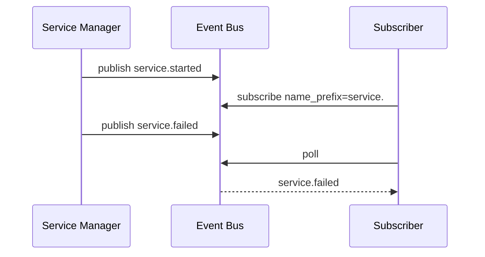

# Event Bus

## Purpose

The Event Bus records internal System Core events and supports subscription-style retrieval. It is currently in-memory and bounded; it is designed as the first step toward persistent audit, telemetry, and streaming notifications.

## Event Fields

| Field | Meaning |
| --- | --- |
| `sequence` | Monotonic event number assigned by the bus. |
| `name` | Event name such as `service.started`. |
| `timestamp_ms` | Millisecond timestamp from the Unix epoch. |
| `source_service` | Service ID that produced or is associated with the event. |
| `correlation_id` | Correlation value for grouping related work. |
| `payload` | UTF-8 payload string. |
| `priority` | `low`, `normal`, `high`, or `critical`. |

## Subscription Filtering

Subscribers may filter by event name prefix, source service, correlation ID, and minimum priority. Each subscription has its own cursor and polls only events that have not already been delivered to that subscription.

## Retention

The current default retention is 1024 events. When the limit is exceeded, the oldest retained events are discarded. Persistent event storage will be added when the audit subsystem is introduced.

## Failure Handling

Event publication is in-memory and does not block service lifecycle operations. Future persistent event sinks must preserve this property by isolating sink failures from service state transitions.
