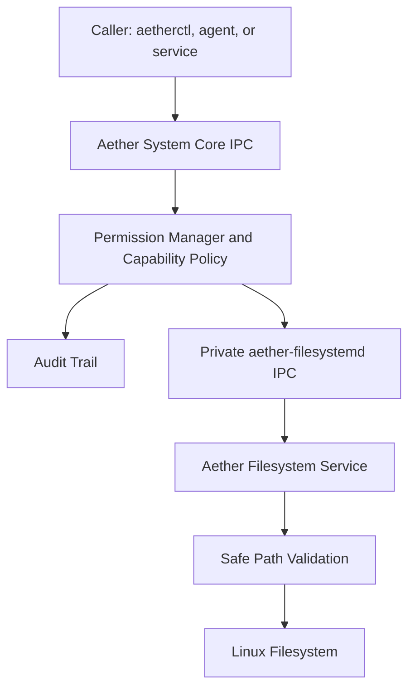

# Aether Filesystem Service

## Purpose

The Aether Filesystem Service provides the Phase 1.5 operating-system abstraction for file and directory operations. AI agents, tools, and applications must use System Core IPC for filesystem requests instead of receiving unrestricted root filesystem access.

## Control Flow

## Responsibilities

The service supports file creation, text reads, text writes, appends, directory listing, directory creation, rename, move, copy, delete, stat, existence checks, directory size calculation, bounded search, mount inspection, storage inspection, and watch registration. Each request maps to a named filesystem capability and returns structured text suitable for Phase 1 IPC tooling.

## Capability Model

| Capability | Risk | Initial Use |
| --- | --- | --- |
| `filesystem.read` | Medium | Read bounded UTF-8 file contents. |
| `filesystem.write` | High | Write or append bounded UTF-8 file contents. |
| `filesystem.create` | Medium | Create files and directories. |
| `filesystem.rename` | High | Rename entries without overwriting destinations. |
| `filesystem.move` | High | Move entries without overwriting destinations. |
| `filesystem.copy` | Medium | Copy files without overwriting destinations. |
| `filesystem.delete` | Critical | Delete files; recursive directory deletion is explicitly marked. |
| `filesystem.list` | Medium | List bounded directory entries. |
| `filesystem.stat` | Low | Read metadata and existence state. |
| `filesystem.search` | Medium | Search names and paths inside a bounded directory scope. |
| `filesystem.watch` | Medium | Register a future watch stream contract. |
| `filesystem.mount.read` | Medium | Read mount boundaries with device fields minimized. |
| `filesystem.storage.info` | Low | Read aggregate capacity and filesystem state. |

## IPC Interface

System Core accepts `fs ...` commands on `/run/aether/ipc/aether-system-core.sock`. After authorization, it forwards the same command to `/run/aether/ipc/aether-filesystemd.sock`. The filesystem daemon socket is private and is not the public application interface.

Initial commands include:

| Command | Capability |
| --- | --- |
| `fs capabilities` | `filesystem.stat` |
| `fs health` | `filesystem.stat` |
| `fs list <path>` | `filesystem.list` |
| `fs stat <path>` | `filesystem.stat` |
| `fs read <path>` | `filesystem.read` |
| `fs write <path> <text>` | `filesystem.write` |
| `fs append <path> <text>` | `filesystem.write` |
| `fs mkdir <path>` | `filesystem.create` |
| `fs rename <from> <to>` | `filesystem.rename` |
| `fs move <from> <to>` | `filesystem.move` |
| `fs copy <from> <to>` | `filesystem.copy` |
| `fs delete <path>` | `filesystem.delete` |
| `fs delete-recursive <path>` | `filesystem.delete` |
| `fs du <path>` | `filesystem.stat` |
| `fs search <path> <pattern>` | `filesystem.search` |
| `fs storage` | `filesystem.storage.info` |
| `fs mounts` | `filesystem.mount.read` |
| `fs watch <path>` | `filesystem.watch` |

## Known Limitations

Phase 1.5 uses the existing text IPC protocol. Binary file transfer, semantic indexing, dynamic mount management, and event streaming are reserved for later phases. Recursive operations are intentionally conservative and bounded.
