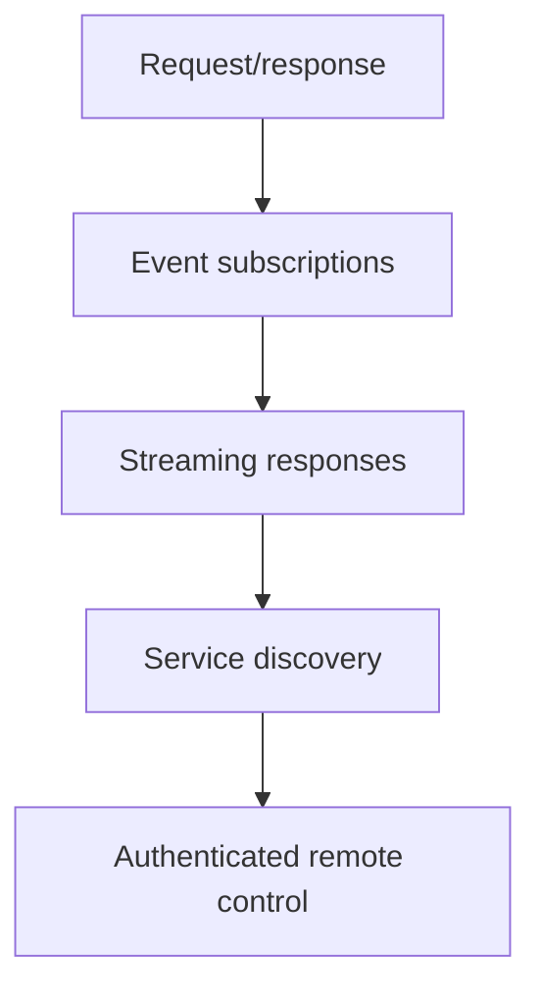

# Aether IPC

## Purpose

Aether IPC is the local control channel between development tools and Aether System Core. The first transport is a Unix-domain socket, but requests and responses are defined independently from that transport.

## Transport

| Property | Current Value |
| --- | --- |
| Default socket | `/run/aether/ipc/aether-system-core.sock` |
| Transport type | Unix-domain stream socket on Unix targets |
| Access pattern | Local request/response |
| Message encoding | Single command line request, status line response |
| Non-Unix behaviour | Builds cleanly and reports transport unavailable |

## Request Model

| Request | Meaning |
| --- | --- |
| `health` | Return aggregate service health. |
| `services` | Return service table. |
| `service status <id>` | Return detailed service status. |
| `service start <id>` | Start one service. |
| `service stop <id>` | Stop one service after dependency checks. |
| `service restart <id>` | Restart one service. |
| `service logs <id>` | Return retained lifecycle events. |
| `system status` | Return high-level system state. |
| `system metrics` | Return metrics snapshot. |
| `system audit` | Return retained IPC authorization decisions. |
| `system shutdown` | Stop services in reverse dependency order. |

## Response Model

Responses begin with `OK` or `ERR`, followed by a UTF-8 body. CLI tools must treat `ERR` as a failed command even when the socket exchange succeeds.

## Security Position

The socket path is local-only and is created with mode `0600` on Unix targets. Requests are capped at 8192 bytes and responses at 1048576 bytes. Service-control and system-control operations require the private local IPC path and every authorization decision is audited.

Peer credential verification is represented in the IPC peer model but not yet backed by kernel credential APIs.

## Evolution Path

The `ipc` module is the only transport-specific boundary. Service manager logic consumes typed requests and returns typed responses.
