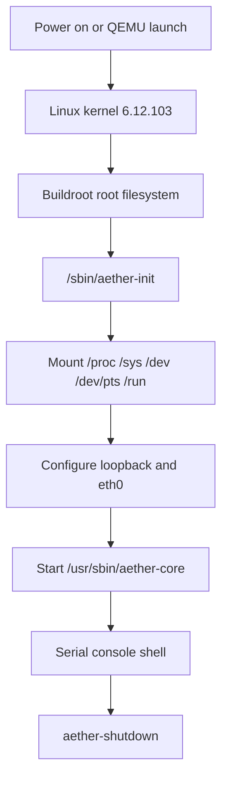

# Phase 1.2 Boot Flow

Phase 1.2 establishes the minimal Linux + Buildroot boot foundation.

## Init Design

`aether-init` is a small shell-based initialization layer for the development image. It
mounts pseudo-filesystems, prepares runtime directories, configures QEMU networking,
starts essential Aether services, emits structured boot logs, exposes a shell, and stops
services during shutdown.

The init layer is not coupled to AI, voice, vision, desktop, plugins, or future agent
systems.

## Aether Core Lifecycle

`aether-core` is the first non-AI Aether system service. It demonstrates:

- Configuration loading from `/etc/aether/aether-core.conf`
- Structured console and file logging
- Health state in `/run/aether/health/aether-core.json`
- Local IPC readiness through `/run/aether/ipc/aether-core.commands`
- Graceful shutdown by signal or `stop` command

No network ports are opened by `aether-core`.

