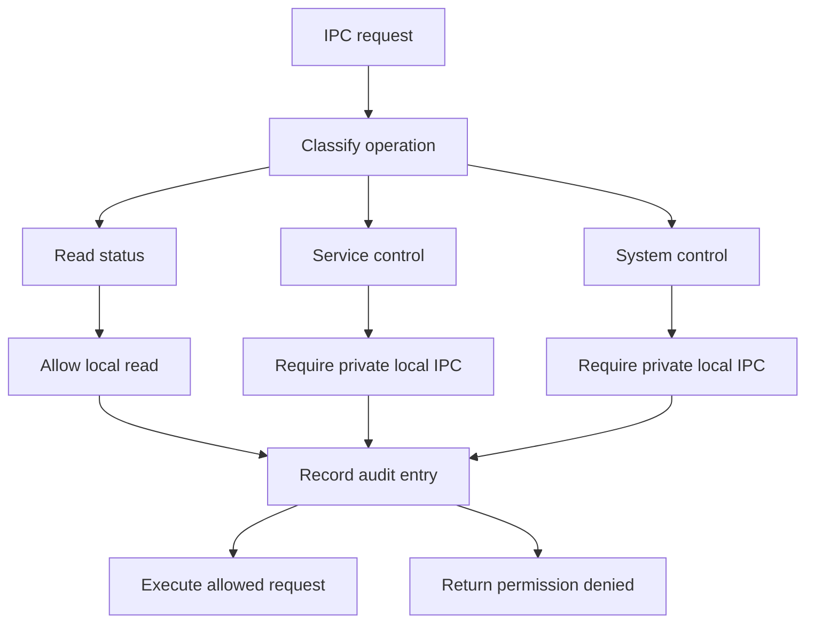

# System Core Hardening

## Phase Scope

Phase 1.4 hardens Aether System Core without adding AI, desktop, voice, or vision capabilities. The goal is to reject unsafe service declarations, constrain the local control channel, and produce audit evidence for all IPC decisions.

## Enforced Controls

| Control | Enforcement |
| --- | --- |
| Manifest security fields | Every manifest declares root need, sandbox profile, permission profile, and IPC access. |
| Manifest resource fields | Every manifest declares CPU weight, memory ceiling, process limit, IO weight, restart limit, and shutdown timeout. |
| Resource bounds | The core rejects restart limits above 25, process limits above 4096, CPU/IO weights above 10000, and shutdown timeouts above 120000 ms. |
| IPC size limit | Requests are capped at 8192 bytes and responses at 1048576 bytes. |
| IPC locality | Control operations require the private local IPC transport. |
| Socket permissions | The Unix-domain control socket is created with mode `0600`. |
| Audit trail | Every IPC permission decision records actor, operation, target, decision, reason, timestamp, and correlation ID. |

## Declared Controls

The service manifest includes fields required for future kernel-backed enforcement. These are validated but not yet enforced through kernel mechanisms:

| Declaration | Future Enforcement |
| --- | --- |
| `security_identity` | Dedicated Unix users and groups. |
| `sandbox_profile` | Namespaces, seccomp, Linux capabilities, and MAC policy. |
| `resource_memory_max_kib` | cgroup memory limits. |
| `resource_cpu_weight` | cgroup CPU weighting. |
| `resource_process_limit` | pids controller and process accounting. |
| `resource_io_weight` | cgroup IO weighting. |

## Permission Model



## Audit Format

Audit records are stored as JSON lines when the daemon is started with `--audit-log`.

| Field | Meaning |
| --- | --- |
| `timestamp_ms` | Millisecond timestamp from Unix epoch. |
| `actor` | Observed peer context for the request. |
| `operation` | `read-status`, `service-control`, or `system-control`. |
| `target` | Service ID or system control surface. |
| `decision` | `allow` or `deny`. |
| `reason` | Permission reason. |
| `correlation_id` | Per-request correlation identifier. |

## Operational Commands

```bash
aetherctl system audit
aetherctl system metrics
aetherctl service restart aether.core
```

## Known Boundaries

Peer credentials are represented in the IPC peer model but not yet verified through kernel credential APIs. The `0600` socket mode is the active access boundary in this phase. Kernel-enforced service identity and resource limits are planned for the next hardening phase.
