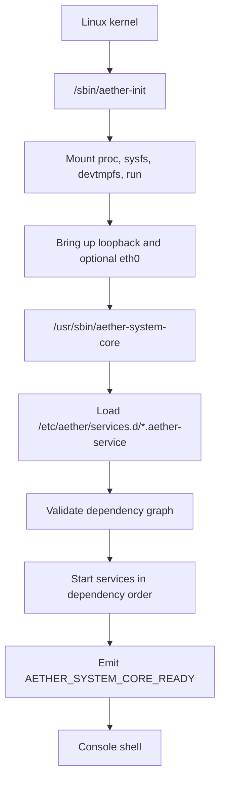
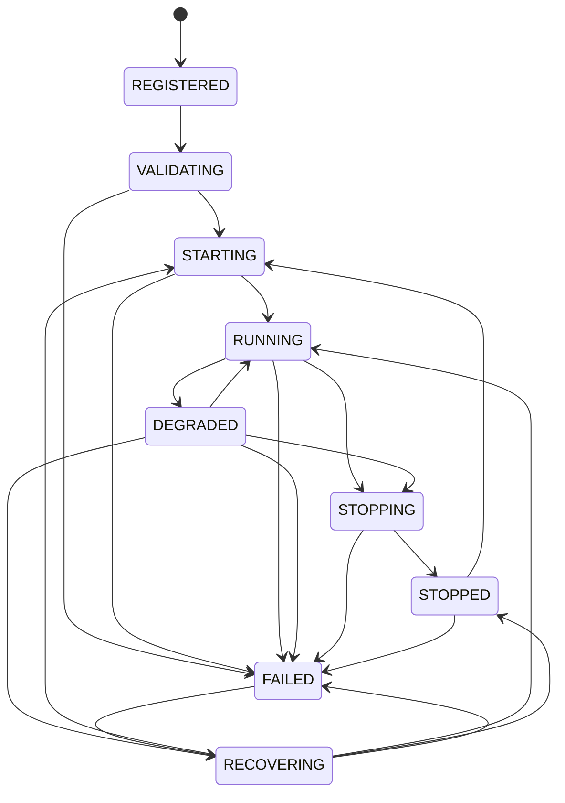

# Aether System Core

## Purpose

Aether System Core is the first userspace coordination layer for Aether OS. It starts after the Linux kernel and the Aether init script, loads declared service manifests, validates dependencies, starts services in dependency order, supervises failures, exposes health, and accepts local control commands through Aether IPC.

This phase does not implement AI, desktop, voice, or vision capabilities. It establishes the service lifecycle foundation those systems will later depend on.

## Responsibilities

| Area | Responsibility |
| --- | --- |
| Service registration | Load `.aether-service` manifests and reject invalid or duplicate service identities. |
| Dependency safety | Detect missing dependencies and circular dependency graphs before startup. |
| Lifecycle control | Move services through explicit lifecycle states and reject invalid transitions. |
| Supervision | Detect process exits, classify failures, apply restart policy, and stop retrying at the restart limit. |
| Health | Evaluate service health declarations and expose aggregate system health. |
| IPC | Serve the local request/response control socket used by `aetherctl`. |
| Events | Publish lifecycle events with sequence, source, correlation, payload, and priority. |
| Metrics | Maintain counters, gauges, and histograms for early diagnostics. |
| Shutdown | Stop services in reverse dependency order and respect declared shutdown timeouts. |

## Boot Placement

If `/usr/sbin/aether-system-core` is unavailable, the init script falls back to the Phase 1.2 `/usr/sbin/aether-core` service.

## System State Model

| State | Meaning |
| --- | --- |
| `BOOTING` | System Core process has been created and is loading manifests. |
| `STARTING_SERVICES` | Registered services are being validated and started. |
| `READY` | Registered services are running or intentionally stopped after shutdown. |
| `DEGRADED` | At least one service reports degraded or unhealthy health while the system can still respond. |
| `RECOVERING` | One or more services are under controlled restart recovery. |
| `SHUTTING_DOWN` | New work is being stopped and services are being terminated. |
| `FAILED` | One or more services failed beyond configured recovery limits. |

## Internal Modules

| Module | Role |
| --- | --- |
| `manifest` | Parses and validates `.aether-service` files. |
| `registry` | Stores registered service manifests by `ServiceId`. |
| `dependency` | Produces startup and shutdown order and detects graph errors. |
| `lifecycle` | Tracks runtime state, health, PID, failures, and transitions. |
| `manager` | Coordinates registration, startup, stop, restart, supervision, health, metrics, and IPC commands. |
| `ipc` | Defines request/response commands and Unix-domain socket transport. |
| `event` | Provides in-memory event publication, subscription, filtering, and retention. |
| `config` | Validates System Core configuration and rejects secret-like keys in normal config. |
| `health` | Evaluates declared health checks. |
| `logging` | Emits structured JSON logs with basic sensitive-value redaction. |
| `metrics` | Tracks counters, gauges, and histograms. |
| `recovery` | Applies restart policy, backoff, and restart limits. |
| `permission` | Classifies IPC operations and authorizes read/control requests. |
| `audit` | Records IPC permission decisions and exposes retained audit entries. |
| `resource` | Validates declared service resource bounds before registration. |
| `shutdown` | Builds reverse-dependency shutdown plans. |
| `state` | Maintains high-level system state snapshots. |

## Service Lifecycle

## Current Runtime Scope

The current implementation provides real manifest loading, dependency resolution, lifecycle enforcement, process spawning, exit detection, bounded restart recovery, file-based health checks, IPC request/response, structured logging, metrics, and reverse-order shutdown.

Security isolation and resource enforcement are represented as manifest declarations in this phase. They are not enforced by cgroups, seccomp, namespaces, Linux capabilities, or MAC policy yet.

## Operational Commands

| Command | Purpose |
| --- | --- |
| `aetherctl services` | List registered services and runtime state. |
| `aetherctl service status <service-id>` | Show detailed status for one service. |
| `aetherctl service start <service-id>` | Start one service after dependency checks. |
| `aetherctl service stop <service-id>` | Stop one service if no running dependent blocks it. |
| `aetherctl service restart <service-id>` | Stop and start a service through the manager. |
| `aetherctl service logs <service-id>` | Show retained lifecycle events for a service. |
| `aetherctl health` | Show aggregate health summary. |
| `aetherctl system status` | Show high-level system state. |
| `aetherctl system metrics` | Show metrics snapshot. |
| `aetherctl system audit` | Show retained IPC authorization decisions. |
| `aetherctl system shutdown` | Request graceful service shutdown. |

## Verification

Host-level tests validate source structure, manifests, dependency ordering, Buildroot package selection, boot script integration, and IPC client shape. Rust unit tests cover parser, lifecycle, dependency, registry, health, logging, metrics, event, recovery, shutdown, and manager behavior when Cargo is available.
