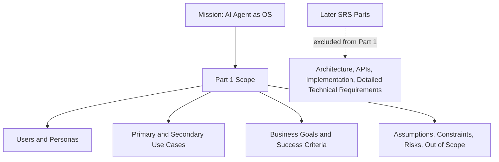
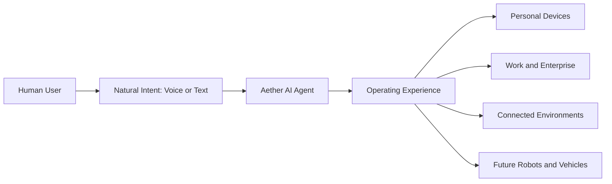
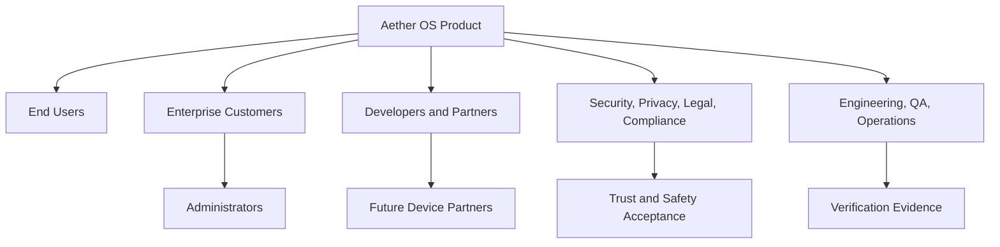

# Project Genesis (Aether OS) Software Requirements Specification - Part 1

Document ID: PG-AOS-SRS-P1-001
Version: 0.1.0
Status: Draft baseline
Date: 2026-08-07
Prepared by: Chief Requirements Engineer
Standard alignment: IEEE 29148 / ISO/IEC/IEEE 29148 style

## 1. Executive Summary

Project Genesis, currently named Aether OS, is a next-generation AI-native operating system initiative. The product vision is to create an operating system where the AI Agent is the primary user interface and orchestration layer for user intent, system interaction, productivity, automation, accessibility, and future device ecosystems.

Unlike traditional desktop operating systems, Aether OS is not centered on launcher-first interaction. The expected user experience is natural-language-first: users shall be able to ask, instruct, delegate, inspect, correct, approve, and recover through voice and text, with visual and contextual assistance where appropriate.

This Part 1 Software Requirements Specification defines the product intent, business context, stakeholder model, target audiences, use cases, scope boundaries, assumptions, constraints, risks, glossary, acronyms, and references. It does not define implementation, architecture, APIs, detailed module behavior, or technical design.

| Summary Attribute | Statement |
| --- | --- |
| Product name | Project Genesis, public working name Aether OS |
| Product category | AI-native operating system |
| Primary differentiator | AI Agent as the primary operating system interaction model |
| Initial product focus | Personal computing and enterprise-managed computing |
| Long-term product horizon | Desktop, laptop, phone, tablet, robot, automobile, IoT, smart home, wearables, cloud, and enterprise environments |
| Core success condition | Users can complete core operating system workflows naturally through AI-mediated voice or text interaction with measurable safety, reliability, and privacy controls |

## 2. Product Vision

Aether OS shall become a trusted AI-native operating system that allows humans to control computing environments through natural intent rather than through manual navigation of applications, menus, settings panels, file hierarchies, and command-line interfaces.

The long-term product vision is one coherent AI operating experience across personal devices, enterprise fleets, edge devices, smart environments, vehicles, and future robots.

Vision statements:

| Vision ID | Vision Statement | Measurable Indicator |
| --- | --- | --- |
| PG-AOS-SRS-P1-VIS-001 | The AI Agent shall be perceived by users as the primary way to operate the system. | In usability studies, at least 80 percent of representative users choose AI-mediated control as their first attempt for certified core workflows. |
| PG-AOS-SRS-P1-VIS-002 | Aether OS shall reduce the need for users to know where features are located. | At least 90 percent of certified core workflows are discoverable through natural language without prior UI training. |
| PG-AOS-SRS-P1-VIS-003 | Aether OS shall preserve human authority over sensitive and irreversible actions. | 100 percent of high-risk certified workflows require visible approval, policy authorization, or documented denial. |
| PG-AOS-SRS-P1-VIS-004 | Aether OS shall be viable as both a personal operating system and an enterprise-managed platform. | Product requirements shall support individual ownership and centrally managed deployment without conflicting baseline assumptions. |

## 3. Mission Statement

The mission of Project Genesis is to create the world's first production-grade AI-native operating system where the AI Agent is the primary operating interface, enabling users and organizations to operate devices, applications, workflows, data, and connected environments through safe, private, reliable, and natural interaction.

Mission requirements:

| Requirement ID | Description | Priority | Acceptance Criteria |
| --- | --- | --- | --- |
| PG-AOS-SRS-P1-MIS-001 | Aether OS shall support natural voice and text interaction as primary operating modes. | Critical | Product validation shall include certified workflows completed through both voice and text. |
| PG-AOS-SRS-P1-MIS-002 | Aether OS shall support AI-mediated control of operating system workflows while preserving user consent and organizational policy. | Critical | All sensitive workflow specifications shall include consent, denial, and recovery outcomes. |
| PG-AOS-SRS-P1-MIS-003 | Aether OS shall be specified for long-term expansion beyond desktop and laptop devices. | High | Scope and future-facing requirements shall explicitly include phone, tablet, robot, automobile, IoT, smart home, wearables, cloud, and enterprise environments. |

## 4. Project Scope

This Part 1 defines the problem space, product boundaries, intended users, business expectations, and validation criteria for Aether OS. It establishes what the product is expected to become without specifying how it shall be implemented.

In-scope product capabilities:

| Scope ID | In-Scope Capability | Scope Boundary | Measurable Scope Test |
| --- | --- | --- | --- |
| PG-AOS-SRS-P1-SCP-001 | AI-native interaction | Voice and text shall be first-class product interaction modes. | Core workflow studies shall measure task completion through voice and text. |
| PG-AOS-SRS-P1-SCP-002 | Operating system control | Users shall be able to request system-level tasks through the AI Agent. | Certified workflow catalog shall include settings, files, apps, notifications, device state, and recovery categories. |
| PG-AOS-SRS-P1-SCP-003 | Personalization and memory | The product shall remember approved user preferences, history, and context. | User validation shall include inspect, correct, and delete flows for remembered information. |
| PG-AOS-SRS-P1-SCP-004 | Enterprise management | The product shall support managed deployment and organizational policy. | Enterprise validation shall include enrollment, policy assignment, reporting, and administrative control scenarios. |
| PG-AOS-SRS-P1-SCP-005 | Multi-device future | The product shall be specified for device classes beyond personal computers. | Product planning artifacts shall include explicit readiness criteria for all target device classes. |
| PG-AOS-SRS-P1-SCP-006 | Accessibility | The product shall support users who rely on voice, keyboard, assistive output, or alternative interaction models. | Accessibility validation shall include non-pointer workflows and assistive technology compatibility. |

Scope boundary diagram:

## 5. Objectives

Objectives define the measurable outcomes that the product shall satisfy at the product level.

| Objective ID | Objective | Priority | Measurement Method | Target |
| --- | --- | --- | --- | --- |
| PG-AOS-SRS-P1-OBJ-001 | Enable users to operate core system workflows through natural language. | Critical | Usability test across representative users and certified workflows. | At least 90 percent successful completion for core workflows without launcher-first navigation. |
| PG-AOS-SRS-P1-OBJ-002 | Establish AI as the primary user-facing control model. | Critical | First-action preference and completion-path analysis. | At least 80 percent of tested users attempt AI interaction first after onboarding. |
| PG-AOS-SRS-P1-OBJ-003 | Preserve user trust through explainable, consent-aware behavior. | Critical | Safety review and user study. | 100 percent of sensitive actions present understandable approval or denial information. |
| PG-AOS-SRS-P1-OBJ-004 | Support enterprise adoption requirements from the beginning. | High | Enterprise stakeholder review. | Requirements baseline covers identity, policy, audit, managed deployment, support, and compliance at product-scope level. |
| PG-AOS-SRS-P1-OBJ-005 | Support offline usefulness for essential operation. | High | Offline product validation. | Essential workflows remain available when internet connectivity is unavailable. |
| PG-AOS-SRS-P1-OBJ-006 | Define a product scope that can expand to emerging device classes. | Medium | Product roadmap review. | All target device classes have documented inclusion criteria and out-of-scope boundaries for this phase. |

## 6. Product Perspective

Aether OS is intended to be a complete operating system product, not a standalone assistant application. From the user's perspective, the AI Agent is the primary surface for expressing intent and receiving action-oriented assistance. Traditional visual controls may remain available, but they are secondary and supportive rather than the dominant interaction model.

Product context:

Product perspective requirements:

| Requirement ID | Description | Priority | Acceptance Criteria |
| --- | --- | --- | --- |
| PG-AOS-SRS-P1-PRD-001 | Aether OS shall be specified as an operating system product rather than an application add-on. | Critical | Scope review shall confirm that core OS workflows are included in product requirements. |
| PG-AOS-SRS-P1-PRD-002 | The AI Agent shall be treated as the primary operating interaction model in product requirements. | Critical | All core user journeys shall identify the AI-mediated path before optional manual alternatives. |
| PG-AOS-SRS-P1-PRD-003 | Visual, touch, keyboard, and manual interfaces shall remain available where needed for accessibility, verification, correction, and user preference. | High | User experience requirements shall include alternative interaction paths for critical workflows. |
| PG-AOS-SRS-P1-PRD-004 | The product perspective shall support both individual-owned and organization-managed devices. | High | Stakeholder and use-case coverage shall include personal users and enterprise administrators. |

## 7. Target Audience

The target audience includes users, buyers, administrators, developers, and ecosystem partners who need a trustworthy AI-native operating environment.

| Audience ID | Audience Segment | Need | Success Measure |
| --- | --- | --- | --- |
| PG-AOS-SRS-P1-AUD-001 | General consumers | Natural device control, personal productivity, privacy, simple recovery. | Users complete everyday workflows without training in system navigation. |
| PG-AOS-SRS-P1-AUD-002 | Knowledge workers | Faster app, document, browser, meeting, and communication workflows. | Users report measurable time reduction for repeated workflows. |
| PG-AOS-SRS-P1-AUD-003 | Software developers | AI-supported development workflows that protect existing work. | Developers complete project inspection, build, test, and explanation workflows safely. |
| PG-AOS-SRS-P1-AUD-004 | Enterprise administrators | Managed deployment, policy, audit, support, and compliance. | Administrators can validate fleet state and enforce organizational controls. |
| PG-AOS-SRS-P1-AUD-005 | Accessibility users | Voice-first and assistive interaction. | Critical workflows can be completed without pointer-only interaction. |
| PG-AOS-SRS-P1-AUD-006 | Plugin and app developers | Stable product expectations for ecosystem participation. | Developer onboarding materials clearly describe supported extension opportunities and constraints. |
| PG-AOS-SRS-P1-AUD-007 | Future device partners | Alignment for phone, tablet, robot, automobile, IoT, smart home, wearables, and cloud scenarios. | Partner planning can map device-specific opportunities to product scope. |

## 8. Stakeholders

| Stakeholder ID | Stakeholder | Role in Product Lifecycle | Primary Concerns | Decision Influence |
| --- | --- | --- | --- | --- |
| PG-AOS-SRS-P1-STK-001 | End users | Daily operators of Aether OS. | Usability, trust, privacy, safety, personalization, reliability. | High |
| PG-AOS-SRS-P1-STK-002 | Accessibility users and advocates | Validate inclusive interaction. | Voice access, captions, screen readers, alternative input, clarity. | High |
| PG-AOS-SRS-P1-STK-003 | Enterprise customers | Purchase and deploy managed devices. | Policy, audit, compliance, identity, support, data control. | High |
| PG-AOS-SRS-P1-STK-004 | Enterprise administrators | Operate and govern fleets. | Deployment, enforcement, reporting, update control, remote assistance. | High |
| PG-AOS-SRS-P1-STK-005 | Security and privacy teams | Approve risk posture. | Least privilege, consent, data handling, monitoring, incident response. | High |
| PG-AOS-SRS-P1-STK-006 | Product management | Own market fit and roadmap. | Differentiation, adoption, satisfaction, scope control. | High |
| PG-AOS-SRS-P1-STK-007 | Engineering teams | Build, validate, and operate product. | Clear requirements, traceability, testability, risk handling. | High |
| PG-AOS-SRS-P1-STK-008 | Quality assurance teams | Validate acceptance criteria. | Measurable tests, regression coverage, reproducibility. | High |
| PG-AOS-SRS-P1-STK-009 | Developers and ecosystem partners | Build apps, plugins, and integrations. | Predictable behavior, product positioning, user trust. | Medium |
| PG-AOS-SRS-P1-STK-010 | OEM and hardware partners | Package and certify devices. | Device readiness, support expectations, recovery, updates. | Medium |
| PG-AOS-SRS-P1-STK-011 | Legal and compliance teams | Govern regulatory and contractual obligations. | Privacy, accessibility, records, jurisdictional constraints. | High |
| PG-AOS-SRS-P1-STK-012 | Future robotics, vehicle, and IoT partners | Extend Aether OS into physical environments. | Safety, responsibility boundaries, authorization, certification. | Medium |

Stakeholder relationship diagram:

## 9. User Personas

| Persona ID | Persona | Profile | Goals | Pain Points | Product Success Criteria |
| --- | --- | --- | --- | --- | --- |
| PG-AOS-SRS-P1-PER-001 | Maya, general user | Non-technical personal user with daily productivity needs. | Find files, control settings, manage messages, troubleshoot common issues. | Does not know where system features are located. | Completes core daily tasks through natural language with minimal clarification. |
| PG-AOS-SRS-P1-PER-002 | Arjun, developer | Professional software engineer using local projects and cloud tools. | Inspect projects, run tests, understand failures, automate routine developer work. | Risk of AI overwriting work or running unsafe commands. | AI assistance is useful while preserving explicit control over destructive operations. |
| PG-AOS-SRS-P1-PER-003 | Elena, enterprise administrator | IT leader managing thousands of devices. | Enforce policy, monitor fleet health, audit AI actions, manage updates. | Needs trust, consistency, and compliance evidence. | Managed devices report policy and audit status reliably. |
| PG-AOS-SRS-P1-PER-004 | Sam, accessibility-first user | User who relies heavily on voice and assistive feedback. | Operate device without pointer dependency. | Traditional interfaces are slow or inaccessible. | Critical workflows are voice-accessible, reviewable, and correctable. |
| PG-AOS-SRS-P1-PER-005 | Omar, field technician | Support specialist assisting remote users. | Diagnose issues, guide users, request approved remote assistance. | Remote support can be risky and hard to explain. | Remote assistance is consent-based, visible, and auditable. |
| PG-AOS-SRS-P1-PER-006 | Nia, future robotics operator | Operator of connected physical systems. | Use AI to understand status and propose actions in physical environments. | Physical actions carry safety risk. | AI suggestions remain bounded by explicit safety and authorization expectations. |
| PG-AOS-SRS-P1-PER-007 | Priya, privacy-conscious professional | Handles sensitive documents and personal data. | Use AI productivity features without unwanted cloud or memory exposure. | Distrust of opaque data handling. | Product clearly communicates what is remembered, shared, or processed. |

## 10. Primary Use Cases

Primary use cases are expected to influence first releases, validation planning, onboarding, and product acceptance.

| Use Case ID | Use Case | Primary Actor | Precondition | Expected Outcome | Measurable Acceptance |
| --- | --- | --- | --- | --- | --- |
| PG-AOS-SRS-P1-PUC-001 | Natural-language OS control | End user | User is authenticated or in an allowed pre-login state. | User completes common OS tasks through voice or text. | Certified core workflow completion rate shall be at least 90 percent. |
| PG-AOS-SRS-P1-PUC-002 | File and knowledge retrieval | End user | User has approved access to relevant local or synced data. | User finds documents, facts, and prior work by describing intent. | Retrieval tests shall return correct target in top 3 results for certified scenarios. |
| PG-AOS-SRS-P1-PUC-003 | Application assistance | Knowledge worker | Relevant app is installed or available. | User asks AI to help operate application workflows. | Certified app workflows shall complete with user-visible confirmation where needed. |
| PG-AOS-SRS-P1-PUC-004 | Browser assistance | Knowledge worker | User grants browser context access. | AI assists with navigation, summarization, form support, and research. | Browser tasks shall distinguish trusted user intent from untrusted page content. |
| PG-AOS-SRS-P1-PUC-005 | Safe system change | End user or administrator | Requested change affects system behavior. | AI explains effect, obtains approval where required, and reports outcome. | 100 percent of sensitive system-change workflows shall include approval or denial record. |
| PG-AOS-SRS-P1-PUC-006 | Personalized workflow continuation | End user | User has approved memory or context retention. | AI resumes or adapts workflows based on prior context. | User shall be able to inspect and correct remembered facts used in the workflow. |
| PG-AOS-SRS-P1-PUC-007 | Enterprise device management | Administrator | Device is enrolled in an organization. | Administrator applies policy and receives fleet status. | Managed-device validation shall show policy enforcement and status reporting. |
| PG-AOS-SRS-P1-PUC-008 | Accessibility-first operation | Accessibility user | Required input and output devices are available. | User completes critical workflows without pointer-only interaction. | Accessibility validation shall pass login, navigation, settings, notifications, and recovery scenarios. |
| PG-AOS-SRS-P1-PUC-009 | Developer assistance | Developer | User approves project access. | AI helps inspect, explain, test, and organize development work. | Developer workflows shall protect existing user work and identify risky operations. |
| PG-AOS-SRS-P1-PUC-010 | Offline essential operation | Any user | Device has no internet connectivity. | Essential workflows remain available locally. | Offline validation shall pass defined essential workflow set. |

Primary use-case flow:

## 11. Secondary Use Cases

Secondary use cases are important for roadmap planning and later requirements but are not necessarily required for the first production release.

| Use Case ID | Use Case | Primary Actor | Expected Outcome | Priority | Measurable Acceptance |
| --- | --- | --- | --- | --- | --- |
| PG-AOS-SRS-P1-SUC-001 | Mobile companion approval | End user | User approves or denies sensitive actions from a paired mobile device. | High | Approval state shall synchronize to the original task with correct identity. |
| PG-AOS-SRS-P1-SUC-002 | Remote support assistance | Field technician | Technician assists user with consent and visibility. | High | Remote support session shall include user-visible status and audit record. |
| PG-AOS-SRS-P1-SUC-003 | Smart home interaction | Home user | User asks AI to inspect or control connected home devices. | Medium | Product planning shall define safety and permission requirements before launch. |
| PG-AOS-SRS-P1-SUC-004 | Wearable notification and voice handoff | End user | User receives concise updates and continues tasks from wearable context. | Low | Wearable handoff shall preserve task identity and user privacy classification. |
| PG-AOS-SRS-P1-SUC-005 | Tablet and phone operating mode | Mobile user | AI-native interaction adapts to mobile device constraints. | Medium | Mobile mode requirements shall define touch, battery, connectivity, and privacy boundaries. |
| PG-AOS-SRS-P1-SUC-006 | Vehicle assistance | Driver or passenger | AI assists with non-safety-critical vehicle-adjacent tasks. | Low | Vehicle scope shall exclude safety-critical control unless separately certified. |
| PG-AOS-SRS-P1-SUC-007 | Robotics planning | Robotics operator | AI proposes actions for simulation or human review. | Medium | Physical action requirements shall require explicit safety boundary definition. |
| PG-AOS-SRS-P1-SUC-008 | Cloud workspace continuity | Professional user | User continues AI-mediated work in a cloud-hosted environment. | Medium | Cloud workspace shall preserve user identity, policy, and data boundaries. |

## 12. Business Goals

| Goal ID | Business Goal | Priority | Measurement | Target |
| --- | --- | --- | --- | --- |
| PG-AOS-SRS-P1-BUS-001 | Establish Aether OS as a new AI-native operating system category. | Critical | Market positioning, analyst review, user research, and product validation. | Product narrative and tested workflows clearly distinguish Aether OS from assistant applications. |
| PG-AOS-SRS-P1-BUS-002 | Deliver a trustworthy AI-controlled computing experience. | Critical | Trust, safety, and privacy study. | At least 85 percent of pilot users report that system behavior is understandable and controllable. |
| PG-AOS-SRS-P1-BUS-003 | Enable enterprise adoption without redesigning core product assumptions. | High | Enterprise pilot readiness assessment. | Requirements baseline covers managed deployment, audit, policy, support, and data control. |
| PG-AOS-SRS-P1-BUS-004 | Create an extensible ecosystem opportunity. | High | Partner review and developer feedback. | Product scope identifies app, plugin, workflow, and integration extension opportunities. |
| PG-AOS-SRS-P1-BUS-005 | Reduce friction in everyday computing workflows. | High | Task completion time comparison against traditional workflow. | Certified repeated workflows show at least 30 percent median time reduction in pilot testing. |
| PG-AOS-SRS-P1-BUS-006 | Build a long-term platform for future device categories. | Medium | Roadmap coverage review. | All named future device classes have documented scope assumptions and risk boundaries. |

## 13. Success Criteria

Success criteria define measurable product acceptance indicators for Part 1 scope.

| Criterion ID | Success Criterion | Priority | Measurement Method | Target |
| --- | --- | --- | --- | --- |
| PG-AOS-SRS-P1-CRT-001 | Core workflows are naturally discoverable. | Critical | User study with representative users. | At least 90 percent of users can discover core workflows by asking naturally. |
| PG-AOS-SRS-P1-CRT-002 | AI-mediated completion is reliable for defined core workflows. | Critical | Workflow certification suite. | At least 95 percent completion rate for certified low-risk workflows. |
| PG-AOS-SRS-P1-CRT-003 | Sensitive actions remain controllable. | Critical | Safety and consent validation. | 100 percent of sensitive workflows require explicit approval, policy authorization, or denial. |
| PG-AOS-SRS-P1-CRT-004 | Users understand what happened after an AI action. | High | Comprehension testing. | At least 85 percent of users correctly explain the completed action and its result. |
| PG-AOS-SRS-P1-CRT-005 | Users can inspect and correct personalization. | High | Memory and preferences usability testing. | At least 90 percent of test participants can find and correct an example remembered preference. |
| PG-AOS-SRS-P1-CRT-006 | Enterprise buyers can validate governance readiness. | High | Enterprise pilot checklist. | 100 percent of required pilot controls are visible, testable, and documented at scope level. |
| PG-AOS-SRS-P1-CRT-007 | Accessibility workflows are not secondary afterthoughts. | Critical | Accessibility certification testing. | Critical workflows pass voice, keyboard, and assistive-output validation. |
| PG-AOS-SRS-P1-CRT-008 | Offline essential use is credible. | High | Offline validation. | Defined essential workflows remain available without internet connectivity. |

## 14. Assumptions

| Assumption ID | Assumption | Priority | Validation Method | Impact if False |
| --- | --- | --- | --- | --- |
| PG-AOS-SRS-P1-ASM-001 | Users will accept AI as a primary OS interface if control, transparency, and fallback options are strong. | Critical | User research and pilot studies. | Product adoption risk increases. |
| PG-AOS-SRS-P1-ASM-002 | Initial releases will focus on desktop and laptop experiences before full phone, vehicle, robot, and wearable deployment. | High | Roadmap governance approval. | Requirements sequencing may need revision. |
| PG-AOS-SRS-P1-ASM-003 | Enterprise customers will require policy, audit, identity, and data-control capabilities before broad deployment. | Critical | Enterprise customer discovery. | Enterprise launch may be blocked. |
| PG-AOS-SRS-P1-ASM-004 | Users will need non-AI fallback paths for trust, accessibility, correction, and degraded operation. | Critical | Usability and accessibility testing. | AI-only design could exclude users or fail during outages. |
| PG-AOS-SRS-P1-ASM-005 | Regulatory expectations for AI, privacy, accessibility, and security will evolve during the product lifecycle. | High | Legal and compliance review. | Product may require additional controls before launch. |
| PG-AOS-SRS-P1-ASM-006 | Hardware capability will vary widely across target devices. | High | OEM and device-class assessment. | Product may need tiered capability definitions. |
| PG-AOS-SRS-P1-ASM-007 | Users will expect the system to explain sensitive actions before execution. | Critical | Trust and safety research. | Lack of explanations may reduce adoption and increase risk. |

## 15. Constraints

| Constraint ID | Constraint | Priority | Verification Method | Risk if Violated |
| --- | --- | --- | --- | --- |
| PG-AOS-SRS-P1-CON-001 | Aether OS shall be specified as a Linux-based operating system initiative. | Critical | Scope and roadmap review. | Product identity and engineering assumptions become inconsistent. |
| PG-AOS-SRS-P1-CON-002 | Part 1 shall not define implementation, architecture, APIs, or source-code-level behavior. | Critical | Document review. | Requirements baseline becomes prematurely prescriptive. |
| PG-AOS-SRS-P1-CON-003 | Requirements shall be written in measurable and testable language where applicable. | Critical | Requirements quality review. | Engineering and QA cannot validate product intent. |
| PG-AOS-SRS-P1-CON-004 | User trust, privacy, security, and accessibility shall be treated as product constraints, not optional enhancements. | Critical | Stakeholder sign-off and acceptance criteria review. | Product may fail enterprise, legal, or user acceptance. |
| PG-AOS-SRS-P1-CON-005 | The product shall support operation under limited or unavailable internet connectivity for essential workflows. | High | Offline use-case validation. | Product becomes unusable during outages or restricted environments. |
| PG-AOS-SRS-P1-CON-006 | Future physical-world device categories shall not be specified as unconstrained AI control targets. | Critical | Safety review for robot, vehicle, IoT, and smart-home scope. | Product may create unacceptable safety risk. |
| PG-AOS-SRS-P1-CON-007 | Enterprise-managed operation shall not remove baseline user safety and transparency expectations unless governed by documented policy. | High | Enterprise policy review. | Managed deployments may erode trust or compliance posture. |

## 16. Risks

| Risk ID | Risk | Probability | Impact | Trigger | Mitigation Requirement | Owner |
| --- | --- | --- | --- | --- | --- | --- |
| PG-AOS-SRS-P1-RSK-001 | Users may not trust AI-mediated control of sensitive operating system actions. | Medium | High | Users avoid AI for system changes in pilot testing. | Sensitive actions shall include explanation, approval, and visible result. | Product, UX, Security |
| PG-AOS-SRS-P1-RSK-002 | Natural language misunderstanding may cause incorrect task execution. | High | High | Intent accuracy fails target thresholds. | Critical workflows shall include clarification or confirmation when ambiguity is detected. | AI, QA |
| PG-AOS-SRS-P1-RSK-003 | Privacy concerns may reduce adoption. | High | High | Users disable memory, cloud processing, or telemetry in large numbers. | Users shall be able to inspect, control, and delete personalization data. | Privacy, Product |
| PG-AOS-SRS-P1-RSK-004 | Enterprise requirements may diverge from consumer requirements. | Medium | High | Enterprise pilots require controls that conflict with consumer usability. | Requirements shall distinguish personal and managed operating contexts. | Enterprise, Product |
| PG-AOS-SRS-P1-RSK-005 | Accessibility needs may be under-specified if treated late. | Medium | High | Accessibility validation identifies blocking issues after design freeze. | Accessibility shall be included in primary use cases and success criteria. | Accessibility, UX |
| PG-AOS-SRS-P1-RSK-006 | Future device-class ambition may create uncontrolled scope expansion. | High | Medium | Roadmap requests add phone, vehicle, robot, or IoT commitments before readiness criteria. | Future device classes shall be included as scoped expansion targets with explicit exclusions. | Product, Program |
| PG-AOS-SRS-P1-RSK-007 | AI market expectations may shift faster than product cycles. | High | Medium | Competitors or model capabilities change user expectations. | Requirements shall emphasize outcomes and validation criteria rather than vendor-specific technologies. | Product Strategy |
| PG-AOS-SRS-P1-RSK-008 | Safety expectations for robotics, automobile, and smart-home scenarios may exceed initial product maturity. | Medium | Critical | Product is asked to perform physical-world control without certification boundary. | Physical-world control shall remain out of scope unless safety requirements are separately approved. | Safety, Legal |

## 17. Out of Scope

The following items are explicitly out of scope for SRS Part 1.

| Out-of-Scope ID | Item | Rationale | Revisit Condition |
| --- | --- | --- | --- |
| PG-AOS-SRS-P1-OOS-001 | Source code, pseudocode, or implementation algorithms. | Part 1 defines product intent and scope only. | Later implementation planning phase. |
| PG-AOS-SRS-P1-OOS-002 | Detailed software architecture. | Architecture shall be addressed separately after requirements baseline approval. | Architecture SRS or design phase. |
| PG-AOS-SRS-P1-OOS-003 | API specifications and SDK contracts. | Interface requirements require later detailed functional and technical requirements. | API and SDK requirements phase. |
| PG-AOS-SRS-P1-OOS-004 | Kernel, compositor, model runtime, database, or infrastructure technology choices. | Technology choices are design decisions, not Part 1 product scope statements. | Architecture and platform design phase. |
| PG-AOS-SRS-P1-OOS-005 | Detailed security control design. | Part 1 defines security expectations and risks only. | Security requirements and threat-model phase. |
| PG-AOS-SRS-P1-OOS-006 | Detailed UI layouts, visual design, or interaction wireframes. | Part 1 identifies user outcomes, not interface design. | UX specification phase. |
| PG-AOS-SRS-P1-OOS-007 | Commercial pricing, packaging tiers, or licensing model. | Business model details require separate commercial planning. | Go-to-market planning phase. |
| PG-AOS-SRS-P1-OOS-008 | Certification claims for robotics, vehicles, medical, aviation, or other regulated physical systems. | Such domains require separate safety and regulatory specifications. | Regulated-domain readiness phase. |

## 18. Glossary

| Term | Definition |
| --- | --- |
| Aether OS | Working product name for the AI-native operating system developed under Project Genesis. |
| AI Agent | The primary AI-mediated operating interface through which users express intent and receive assistance. |
| AI-native operating system | An operating system whose primary interaction and task model is built around AI-mediated understanding, planning, memory, and action. |
| Certified workflow | A product workflow that has defined acceptance criteria and has passed validation for release. |
| Consent | User or authorized administrator approval for an action, data use, or persistent behavior. |
| Core workflow | A common operating system task expected to be supported in initial product validation. |
| Enterprise-managed device | A device governed by organizational identity, policy, monitoring, and administrative controls. |
| Launcher-first workflow | A traditional interaction pattern where the user starts by manually finding an app, menu, or setting before completing a task. |
| Memory | Product capability that stores approved user, task, preference, project, or contextual information for future assistance. |
| Natural language interaction | Interaction through ordinary spoken or written language rather than formal commands or manual navigation. |
| Personalization | Adaptation of product behavior based on approved preferences, history, habits, or context. |
| Policy | A user, enterprise, legal, safety, or system rule that constrains product behavior. |
| Primary use case | A use case expected to influence early product validation and release acceptance. |
| Secondary use case | A use case important for roadmap planning but not necessarily required for the first production release. |
| Sensitive action | Any action that can affect privacy, security, data integrity, identity, system state, finances, legal state, or physical-world safety. |
| Stakeholder | Any person, group, or organization with a significant interest in product requirements, delivery, operation, or outcomes. |

## 19. Acronyms

| Acronym | Meaning |
| --- | --- |
| AI | Artificial Intelligence |
| API | Application Programming Interface |
| IoT | Internet of Things |
| ISO | International Organization for Standardization |
| OS | Operating System |
| QA | Quality Assurance |
| SRS | Software Requirements Specification |
| UX | User Experience |

## 20. References

| Reference ID | Reference | Purpose |
| --- | --- | --- |
| PG-AOS-SRS-P1-REF-001 | ISO/IEC/IEEE 29148:2018 official ISO record: https://www.iso.org/standard/72089.html | Requirements engineering and SRS style alignment. |
| PG-AOS-SRS-P1-REF-002 | IEEE 29148-2018 official IEEE standards record: https://standards.ieee.org/standard/29148-2018.html | Requirements engineering standard reference. |
| PG-AOS-SRS-P1-REF-003 | IEEE Xplore record for ISO/IEC/IEEE 29148:2018: https://ieeexplore.ieee.org/document/8559686 | Published standards record reference. |
| PG-AOS-SRS-P1-REF-004 | Project stakeholder prompt dated 2026-08-07. | Source of requested Part 1 content scope. |
